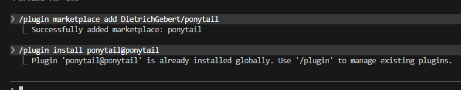

# Claude Code 설치와 첫 실행

클로드 코드 형태

| 형태                                          | CLI 설치 필요? | 특징                                                                         |
| ------------------------------------------- | ---------- | -------------------------------------------------------------------------- |
| CLI (터미널)                                   | 필수         | 기본. `claude` 명령으로 실행                                                       |
| VS Code 확장                                  | 부분적으로 필요   | 채팅 패널은 자체 CLI가 내장돼 있어 그냥 되지만, **통합 터미널에서 `claude` 명령을 쓰려면 CLI를 따로 설치해야 함** |
| 데스크톱 앱                                      | 불필요        | 단독 실행                                                                      |
| 웹 ([claude.ai/code](http://claude.ai/code)) | 불필요        | 클라우드에서 실행, 그냥 대화형                                                          |

VS Code 확장만 깔면 채팅은 되는데 터미널에서 `claude`를 치면 "명령을 찾을 수 없음"이 뜬다. 확장이 쓰는 CLI는 확장 안에 숨어 있어서 PATH에 없기 때문.

**MCP 설정처럼 터미널에서 해야 하는 작업이 있으면 CLI를 따로 깔아야 한다.**

### Windows 설치

아래에서 운영체제에 맞게 설치하기

[Download Claude | Claude by Anthropic](https://claude.com/download)

설치후 cmd를 통해 확인 가능!

```powershell
claude --version    # 예: 2.1.198 (Claude Code)
claude doctor       # 설치 상태와 설정 점검
```

### 인증

처음 `claude`를 실행하면 브라우저가 열리고 Claude 계정으로 로그인한다. 자격 증명이 로컬에 저장돼서 다음부터는 안 물어본다.

`ANTHROPIC_API_KEY` 환경변수가 설정돼 있으면 로그인 대신 그 키를 쓸지 물어본다. 세션 중에 `/login`으로 계정을 다시 인증할 수도 있다.

### ⚠️ 실행 위치가 곧 프로젝트 루트다

`claude`는 **명령을 실행한 디렉터리**를 작업 폴더로 잡는다. 그 위치와 상위 폴더에서 `CLAUDE.md`, `.claude/`, `.git`을 찾는다.

`/add-dir` 명령어를 통해서 다른 디렉토리도 추가 가능하다.\
위 명령어는 vs Code 확장에선 보이지 않음.. CLI에서만 확인 가능

<figure><figcaption></figcaption></figure>

아니면 md에 다른 디렉토리의 경로를 적어둬도 됨

### 기본 명령어

터미널에서:

```powershell
claude                  # 대화형 시작
claude "이 버그 고쳐줘"   # 작업 하나 시키고 시작
claude -c               # 최근 대화 이어서
claude update           # 수동 업데이트
```

세션 안에서:

| 명령         | 하는 일                                   |
| ---------- | -------------------------------------- |
| `/help`    | 명령 목록                                  |
| `/clear`   | 대화 기록 비우기                              |
| `/model`   | 모델 변경                                  |
| `/init`    | 프로젝트 [CLAUDE.md](http://claude.md/) 생성 |
| `/memory`  | 메모리 파일 편집                              |
| `/context` | 컨텍스트 사용량 확인                            |
| `/mcp`     | MCP 서버 상태                              |
| `/doctor`  | 설정 진단                                  |

유용한 명령어는 따로 정리예정..

단축키는 **Esc**로 작업 즉시 중단, **Shift+Tab**으로 권한 모드 순환(수동 → 계획 → 편집 자동승인 → 자동), **↑**&#xB85C; 명령 히스토리.
