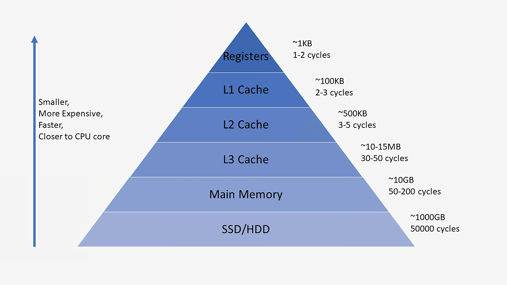

# cache

**자주 사용하는 데이터를 임시로 저장**하여 성능을 향상 시킴

캐시는 저장 공간이 작고 비용이 비싼 대신 빠른 성능을 제공한다.

출처: [https://mangkyu.tistory.com/69](https://mangkyu.tistory.com/69)

## **캐시의 동작 원리**

1. **데이터 요청**
    - 사용자가 어떤 데이터를 요청하면, 시스템은 먼저 캐시에서 해당 데이터를 찾는다.
2. **캐시에 데이터가 존재(O)**
    - 즉시 반환 (빠른 응답)
3. **캐시에 데이터가 없음(X)**
    - 원본 데이터베이스(DB)나 외부 API에서 데이터를 가져와 캐시에 저장
    - 이후 같은 요청이 오면 캐시에서 반환하여 성능 향상

## **대표적인 캐시 기술**

- **Redis**: 인메모리 데이터 저장소, 키-값 기반 캐시 (주로 세션 관리, 실시간 데이터 저장)
- **CDN (Cloudflare, AWS CloudFront 등)**: 정적 파일(이미지, CSS, JS) 캐싱
- **AWS ElastiCache**: 클라우드 기반 캐시 서비스 (Redis, Memcached 지원)

## **정리**

캐시는 자주 사용하는 데이터를 저장하는 임시 저장소이다.

캐시는 저장공간이 작고 비용이 비싸다

캐시와 원본 데이터의 일관성이 중요할 것 같다.

대용량 데이터를 캐시로 이용할지 고려해봐야할것같다.
