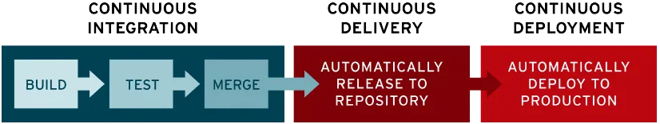

# CI/CD

CI `Continuos Intergration`  : 지속적인 통합, 개발자가 변경한 코드를 지속적으로 통합하고 테스트하여 버그를 조기에 발견

버그 수정, 새로운 기능 개발한 코드가 주기적으로 Main Repository에 병합되는 것을 의미

- 목적 : 작은 단위의 코드를 자주 통합하고, 에러를 빠르게 발견
- 동작
    1. git push 이벤트 트리거
    2. 유닛 테스트, 린트, 타입 체크 실행
    3. 빌드 성공/실패 여부 알림
- 도구 : github Actions, GitLab CI, Jenkins, CircleCI

장점 : 개발 생산성 향상, 빠른 문제 파악, 코드 퀄리티 향상

CD `Continuous Deployment` & `Continuous Delivery`  : 지속적인 배포, 통합된 코드를 테스트 후 자동으로 운영 또는 준비 서버에 배포

- 목적 : 테스트된 코드를 신속하고 안전하게 배포
- 동작 :
    
    docker 빌드
    
    aws, kubernetes, Nginx, s3 등으로 배포
    
    슬랙/이메일 알림
    
- 차이점
    
    Continuous Delivery : 운영 배포 수동 승인 필요(안정성 중시)
    
    Continuous Deploymen : 운영까지 자동 배포(속도 중시)
    

CI/CD 파이프라인 흐름

1. 코드 작성 (개발자가 Git에 Push)
2. CI 서버 감지 (ex. GitHub Actions, Jenkins 등)
3. 코드 빌드 (의존성 설치, 테스트 수행)
4. 코드 린트/테스트/보안 검사
5. 빌드 아티팩트 생성 (ex. Docker 이미지)
6. CD 단계:
    - 자동으로 테스트 서버 배포 (Delivery)
    - 또는 운영 서버까지 자동 배포 (Deployment)
