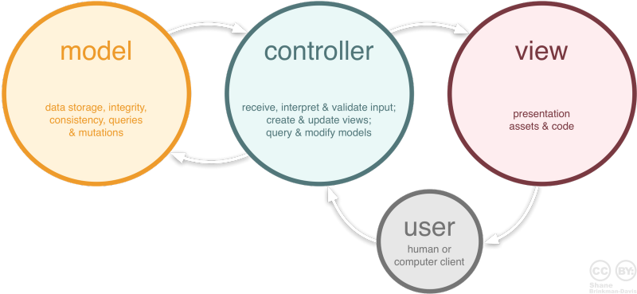

# MVC 패턴

## MVC 패턴 이란?

MVC 패턴은 소프트웨어 디자인 패턴 중 하나로, 소프트웨어를 모델(Model), 뷰(View), 컨트롤러(Controller)로 구성하여 서로 간의 역할을 분리하는 방법을 말합니다.

출처 : 

[[개발자 면접준비]#1. MVC패턴이란](https://m.blog.naver.com/jhc9639/220967034588)

이 블로그 읽어보기!

---

## MVC 패턴의 구성 요소

1. Model
- 어플리케이션의 데이터와 비즈니스 로직을 담당합니다.
- 데이터의 상태를 유지하고, 데이터에 접근하고 조작하는 메서드를 제공합니다.
- 예를 들어, 사용자 정보를 담는 객체나 데이터베이스와의 상호작용을 담당할 수 있습니다.

1. View
- 사용자 인터페이스(UI)를 나타냅니다.
- 데이터의 시각적인 표현을 담당하며, 사용자에게 정보를 보여줍니다.
- 예를 들어, 웹 앱에서는 HTML, CSS, JavaScript 등을 사용하여 웹 페이지를 구성합니다.

1. Controller
- 사용자의 입력을 처리하고, 그에 따라 모델이나 뷰를 업데이트합니다.
- 모델과 뷰 사이의 상호작용을 조정하고 중개합니다.
- 예를 들어, 웹 앱에서는 클라이언트의 요청을 받아 모델의 데이터를 읽거나 수정하고, 그에 맞는 뷰를 선택하여 보여줄 수 있습니다.

---

## MVC 패턴의 장점 & 단점

### 장점

- **분리된 코드:** 각 구성 요소가 독립적으로 관리되므로 코드의 유지보수와 재사용성이 향상됩니다.
- **간결한 코드:** 역할에 따라 코드가 분리되므로 각 부분의 책임이 명확해집니다.
- **테스트 용이성:** 각 구성 요소가 독립적으로 테스트 가능하므로 테스트 작성이 용이합니다.

### 단점

- **복잡성 증가:** MVC 패턴은 소프트웨어를 세 가지 서로 다른 구성 요소로 분리합니다. 이로 인해 애플리케이션의 구조가 더 복잡해질 수 있습니다. 특히 작은 규모의 프로젝트에서는 이 복잡성이 과도할 수 있습니다.
- **너무 많은 중재자:** 컨트롤러가 모델과 뷰 사이의 중재자 역할을 하다 보니 때로는 코드 중복이 발생하거나 불필요한 중개 단계가 추가될 수 있습니다. 이로 인해 성능 저하나 유지보수의 어려움이 발생할 수 있습니다.

→ 실무 프로젝트의 가장 큰 문제점 입니다.
컨트롤러와 모델에 서로 중복되는 기능을 가진 이름이 다른 함수가 다소 존재합니다.

그래서 현재 유지보수가 상당히 어려움 ㅜㅜ >>> 리팩토링 진행중

---

## MVC 패턴 예시

### MVC 패턴으로 TODO List 웹을 개발한다면??

**Model** : ToDo 항목을 나타내는 객체와 데이터베이스와의 상호작용을 담당합니다.

*→ ToDo 항목을 데이터베이서에서 GET, 새로운 ToDo 항목을 데이터베이스에 Insert 등등…*

**Controller** : 사용자의 요청을 받아 모델에서 데이터를 조작하고, 그 결과를 뷰에 반영하여 사용자에게 보여줍니다.

*→ ToDo 항목을 새로 추가하는 요청, ToDo 항목을 삭제하는 요청 등등…*

**View** : ToDo 항목을 시각적으로 표현하는 HTML 템플릿입니다.

---

MVC 패턴 프레임 워크

1. **Django:** Python으로 작성된 Django는 웹 애플리케이션 및 웹 사이트를 개발하는 데 사용되는 높은 수준의 웹 프레임워크입니다. Django는 강력한 MVC 패턴을 따르며, 모델을 정의하는 ORM(Object-Relational Mapping) 기능과 뷰 및 컨트롤러를 관리하는 URL 패턴 시스템을 제공합니다.

1. **Codeigniter** : PHP로 작성된 빠르고 경량의 웹 애플리케이션 프레임워크 중 하나입니다. CodeIgniter는 MVC 아키텍처를 따르며, 개발자가 웹 애플리케이션을 빠르고 효율적으로 개발할 수 있도록 도와줍니다.

그동안 써본 프레임 워크 중에서 Codeigniter가 가장 MVC 패턴이 두드러지게 나타나였습니다!!
