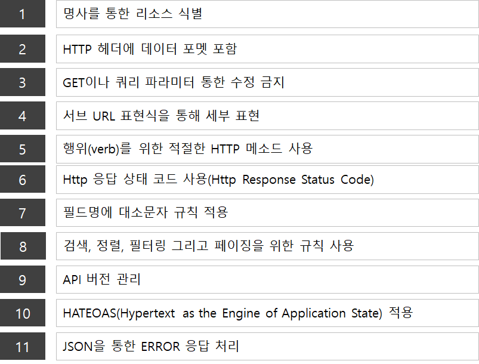

# REST와 RESTful API

[REST](https://ko.wikipedia.org/wiki/REST)

[RESTful API란 무엇인가요? - RESTful API 설명 - AWS](https://aws.amazon.com/ko/what-is/restful-api/)

RESTful API를 설명하기전에 항상 헷갈리는게 있는데 REST와 RESTful API는 비슷하지만 같은건 아니다..

## **REST와 RESTful API의 차이점**

**REST (Representational State Transfer)** : 웹에서 자원을 효과적으로 관리하기 위한 **아키텍처 스타일(설계 원칙)**

**RESTful API** : REST의 원칙을 따르는 **구체적인 API 구현**

→ **REST는 개념(원칙)이고, RESTful API는 이를 적용한 실제 API 이다.**

**모든 RESTful API는 REST 원칙을 따르지만, 모든 REST 기반 API가 RESTful한 것은 아니다.**

## REST

REST(Representational State Transfer)는**자원을 URI로 표현하고, HTTP 메서드로 자원을 조작하는 아키텍처 스타일이다. API를 설계하는 방법론 이다.**

1. REST에서는 자원을 **URI로 표현한다.** 
예: `/users`, `/products`, `/posts` 
2. 행동 HTTP 메서드로 표현
예 : `GET → 조회` `PUT → 수정`
3. 표준 응답 코드
예 : `200 OK → 정상 응답` `201 Created → 생성 성공`

## RESTful API

REST 원칙을 준수하면서 설계된 API입니다. **RESTful API는 REST를 "잘" 적용한 API이다.**



사용자 관련 api 로 restful api 설계에 대해 자세한 설명

1. 사용자 정보 가져오기 (GET)
    
    ```python
    GET /users/1
    ```
    
    응답 (200 OK)
    
    ```python
    {
      "id": 1,
      "name": "John Doe",
      "email": "john@example.com"
    }
    ```
    
    - `GET` 메서드를 사용해 **사용자 정보를 조회**
    - **명사형 URL 사용** (`/users/1`)
    - 적절한 응답 코드 (`200 OK`)
    
2. 새 사용자 생성 (POST)
    
    ```python
    POST /users
    
    {
      "name": "Alice",
      "email": "alice@example.com"
    }
    ```
    
    응답 (201 Created)
    
    ```python
    {
      "id": 2,
      "name": "Alice",
      "email": "alice@example.com"
    }
    ```
    
    - `POST` 메서드를 사용해 **새로운 사용자 생성**
    - `/users` 엔드포인트에 데이터를 추가
    - 성공 시 `201 Created` 반환

1. 사용자 정보 수정 (PUT)
    
    ```python
    PUT /users/1
    
    {
      "name": "John Doe Updated",
      "email": "john.new@example.com"
    }
    ```
    

응답 (200 OK)

```python
{
  "id": 1,
  "name": "John Doe Updated",
  "email": "john.new@example.com"
}
```

- `PUT` 메서드를 사용해 **사용자 정보 전체 수정**
- `/users/1`로 요청 → 특정 사용자의 정보 업데이트
- 전체 정보를 업데이트할 경우 `PUT` 사용 (부분 수정은 `PATCH`)

1. 특정 필드만 수정 (PATCH)
    
    ```python
    PATCH /users/1
    
    {
      "email": "john.patch@example.com"
    }
    ```
    

응답 (200 OK)

```python
{
  "id": 1,
  "name": "John Doe Updated",
  "email": "john.patch@example.com"
}
```

- `PATCH` 메서드를 사용해 **부분 수정**
- 기존 데이터에서 `email`만 변경

1. 사용자 삭제 (DELETE)
    
    ```python
    DELETE /users/1
    ```
    
    응답 (204 No Content)
    
    - `DELETE` 메서드를 사용해 **사용자 삭제**
    - 삭제 성공 시 `204 No Content` 응답 (응답 본문 없음)

## ❤️ 정리

**RESTful API는 REST 원칙을 따르는 API 설계 방법**

**리소스 중심의 URL 설계 (명사 사용, 동사 금지)**

**HTTP 메서드(GET, POST, PUT, PATCH, DELETE)를 올바르게 사용**

**적절한 상태 코드(200, 201, 204, 404 등) 반환**

**JSON 응답 형식을 기본으로 사용**

**API 버전 관리(`/v1/users` 등) 고려**
