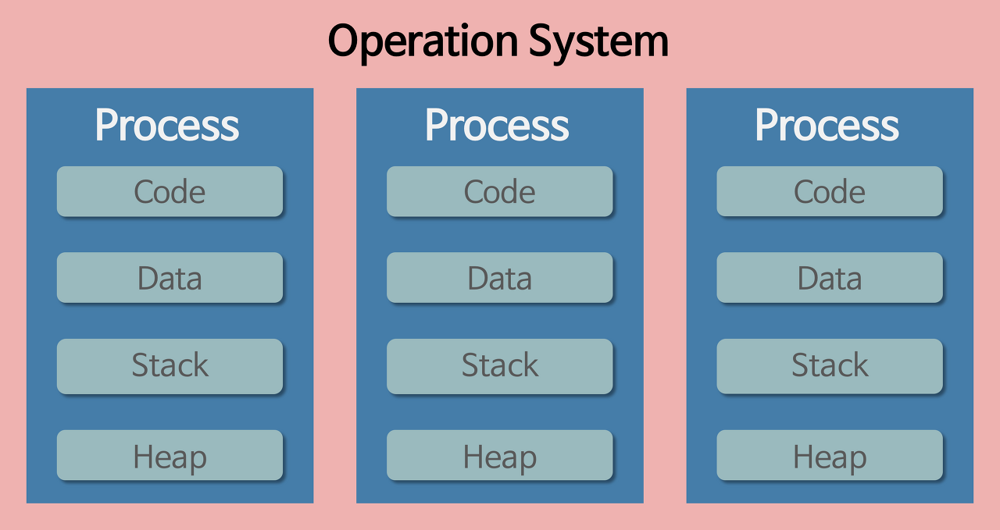
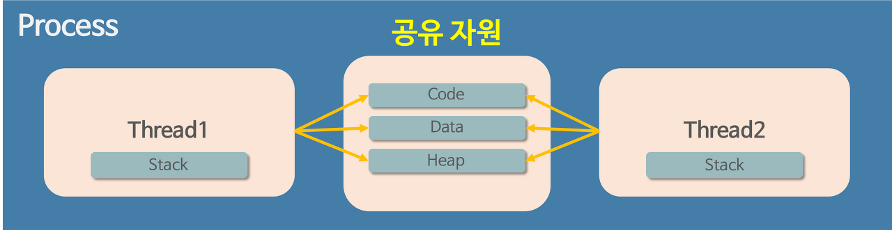

# 프로그램 & 프로세스 & 스레드

[프로세스와 스레드의 차이](https://velog.io/@raejoonee/%ED%94%84%EB%A1%9C%EC%84%B8%EC%8A%A4%EC%99%80-%EC%8A%A4%EB%A0%88%EB%93%9C%EC%9D%98-%EC%B0%A8%EC%9D%B4)

[python 동시성 관리 (1) - 프로세스(Process)와 스레드(Thread)](https://velog.io/@jaebig/python-%EB%8F%99%EC%8B%9C%EC%84%B1-%EA%B4%80%EB%A6%AC-1-%ED%94%84%EB%A1%9C%EC%84%B8%EC%8A%A4Process%EC%99%80-%EC%8A%A4%EB%A0%88%EB%93%9CThread)

[👩‍💻 ‍완전히 정복하는 프로세스 vs 스레드 개념](https://inpa.tistory.com/entry/%F0%9F%91%A9%E2%80%8D%F0%9F%92%BB-%ED%94%84%EB%A1%9C%EC%84%B8%EC%8A%A4-%E2%9A%94%EF%B8%8F-%EC%93%B0%EB%A0%88%EB%93%9C-%EC%B0%A8%EC%9D%B4)

## 프로그램

프로그램은 우리가 작성한 코드, 내가 작성한 코드이다.  단, 아직 실행을 하지 않은 상태를 뜻한다.

정적 프로그램(Static Program) 이라고 한다.

그저 코드 덩어리일뿐이다..

**메모리에 올라가 있지 않은 정적인 상태**

## 프로세스

프로그램을 실행하는 순간 내가 작성한 소스 코드는 컴퓨터 메모리에 올라가게 되고 동적 상태가 된다.

이 상태의 프로그램을 프로세스라고 한다.

**프로그램이 메모리에 올라가서 실행중인 상태**

## 스레드

프로세스 안에서 작업을 수행하는 단위이다. 모든 프로세스는 최소 하나의 스레드(메인 스레드)를 가지고 있다.

하나의 프로세스 안에서 여러 스레드를 만들 수 있고 이것을 **멀티스레딩**이라고 한다.

## 프로세스와 메모리 구조

프로그램이 실행되어 프로세스가 되면 다음과 같이  운영체제가 메모리를 할당한다.

- Code : 내가 작성한 코드가 cpu가 해석 가능한 기계어 형태로 저장된다.
- Data : 코드가 실행되면서 사용하는 전역 변수나 각종 데이터가 모여있다.
- Stack : 지역변수와 같은 호출한 함수가 종료되면 되돌아오는 임시적 자료를 저장하는 독립 공간이다.
- Heap : 개발자가 직접 생성하고 관리하는 메모리 영역, 생성자, 인스턴스와 같은 동적으로 할당되는 데이터들을 위해 존재하는 공간이다.

멀티스레딩 일때의 데이터 구조는 아래와 같다.

4가지 메모리 영역중 스레드는 Stack만 할당받아 복사하고 Code, Data, Heap은 다른 스레드 들과 공유된다.

따라서 각각 스레드는 별도의 stack을 가지고 있지만 heap 메모리는 고유하기 때문에 서로 다른 스레드에서 가져와 읽고 쓸수 있게 된다.

하나의 프로스세를 실행하다가 오류가 발생하여 프로세스가 강제 종료 된다하면, 다른 프로세스는 공유하고 있는 파일을 손상시키는 경우가 아니라면 아무런 영향을 주지 않는다.

그러나 스레드의 경우 Code, Data, Heap 메모리 영역의 내용을 공유하기 때문에 어떤 스레드 하나에서 오류가 발생한다면 같은 프로세스 내의 다른 스레드가 모두 강제로 종료된다.
