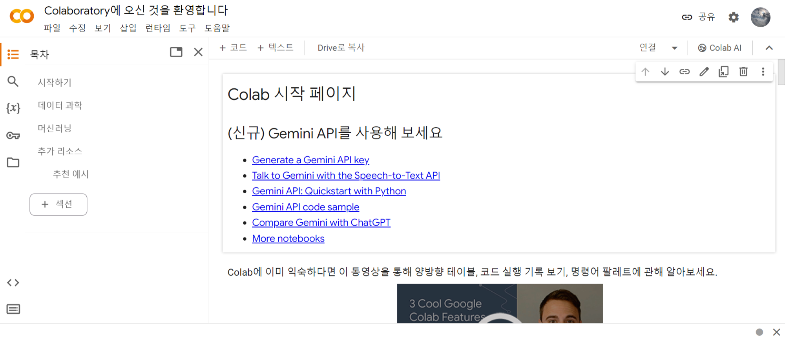
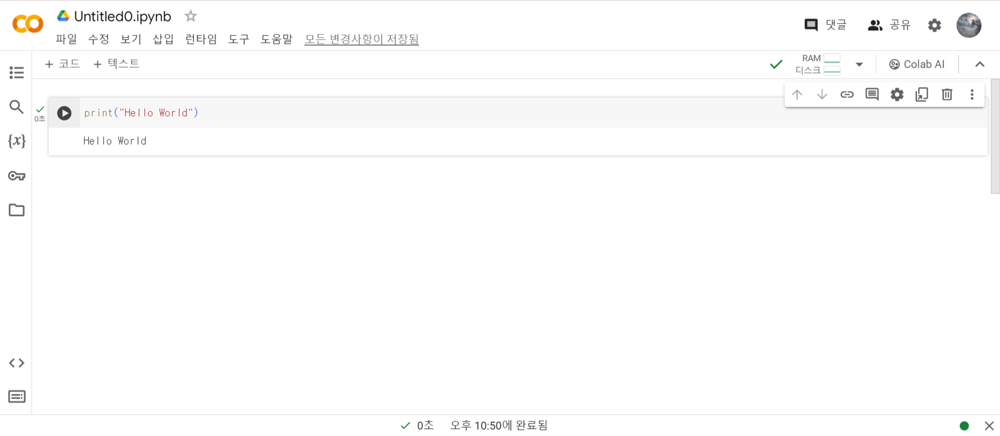

# 코랩

코랩

구글 코랩은 웹 브라우저에서 무료로 파이썬 프로그램을 테스트하고 저장할 수 있는 서비스 이다.

클라우드 기반의 주피터 노트북 개발 환경.

머신러닝은 컴퓨터 사양이 중요한데, 구글 코랩을 사용하면 컴퓨터 성능에 관계없이 사용 가능

무료라 부담이 없지만 코랩 노트북으로 동시에 사용할 수 잇는 구글 클라우드의 가상 서버는 최대 5개 이다.

또한 1개의 노트북을 12시간 이상 실행할 수 없다.

파이썬으로 생성 할 수 있어 어렵지 않다!!

생성된 코랩은 구글 드라이브에 저장되며 언제든지 다시 실행하고 수정할 수 있다.
