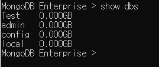
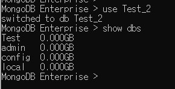
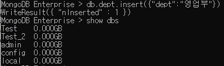
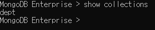
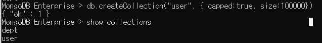

# Database, 컬렉션 생성

mongodb에 작업할 Database와 컬렉션 생성하기

### 1. Database 조회

현재 mongodb에 생성된 database와 크기를 보여줌

```bash
show dbs

show databases
```



명령어 결과

### 2. Database 생성 & 컬렉션 생성

```bash
use [생성할 데이터 베이스 이름]
```

use 를 통해 생성할 수 있다. 그러나 이미 존재하는 데이터 베이스 이름으로 해당명령어를 사용하면 입력된 데이터 베이스가 선택된다.



그런데 Test_2를 생성하였는데 보이지가 않는다..

방금 만든 데이터 베이스를 확인하고 싶으면 하나의 도큐먼트를 생성해야한다!!

```bash
db.dept.insert({"dept":"영업부"})
```



dept 컬렉션에 dept : 영업부 라는 데이터를 insert한다는 의미이다. Mysql의 insert문과 동일하다

mysql과 달리 먼저 Create를 한다음 insert를 해야하는 반면에 **Mongodb는 create와 insert문을 한번에** 작업 할 수 있다!!

생성후 show dbs를 입력하면 생성하였던 Test_2가 보인다!

```bash
show collections
```

위의 명령어로 생성된 dept 컬렉션 확인 가능하다



그런데 값을 넣지 않고 그냥 컬렉션만 생성하고 싶을수도 있다..

```bash
db.createCollection(“컬렉션이름”, { 옵션 })
```

그럴땐 createCollection을 이용하면 된다!!

```bash
db.createCollection("user", { capped: true, size: 100000 })
```

capped는 컬렉션의 사이즈가 지정범위를 넘을 시 오래된 데이터 부터 지우는 옵션이다.



생성된걸 확인
