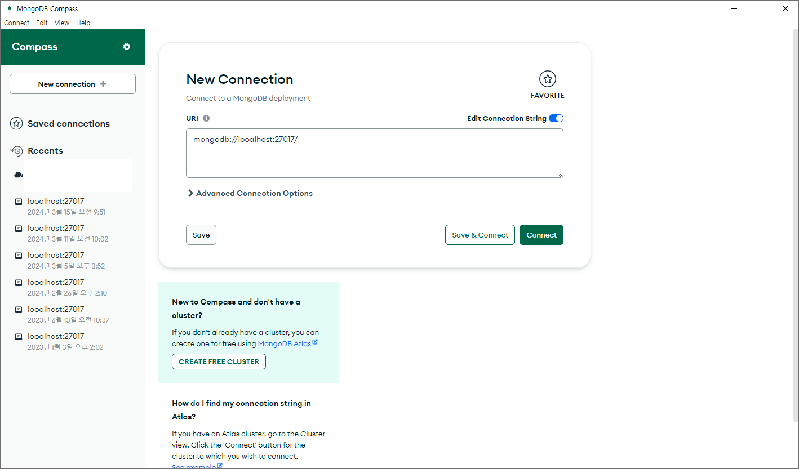
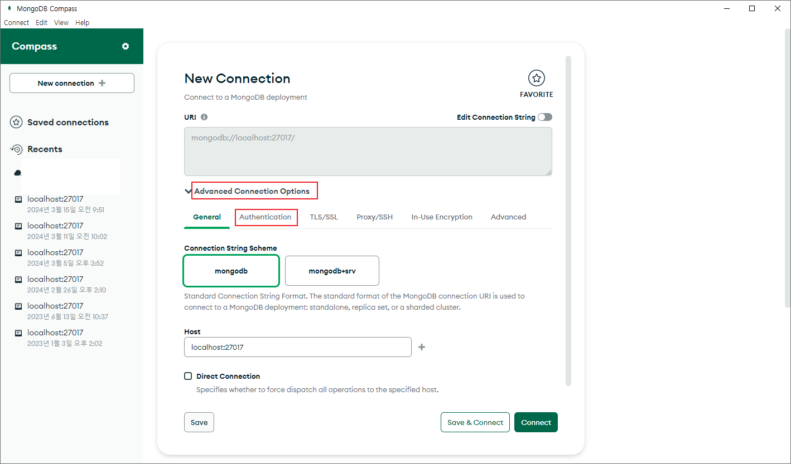
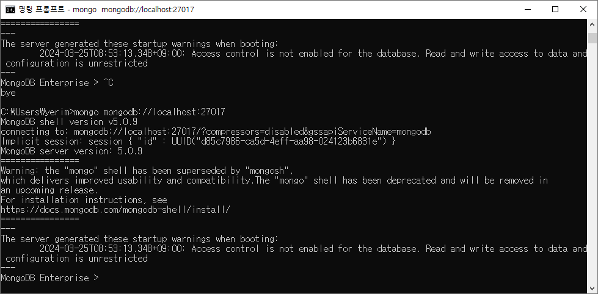
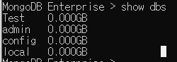

# Mongodb 접속

몽고디비 접속법.

도커, 로컬, 원격 서버 어디든 몽고디비가 이미 설치, 환경변수 설정까지 되었다고 생각하자

## MongoDB Compass로 접속

[MongoDB Compass](https://www.mongodb.com/ko-kr/products/tools/compass)

MongoDB전용 GUI Mysql의 WorkBench, Heidi 같은거이다

다운로드를 해주고 설치가 다 되어 있다 치자!



설치후 컴패스를 실행하면 새연결을 할 수 있다
url에 접속하려는 몽고디비 주소를 직접 입력하면된다.



그냥 Connect를 누르면 안될수도 있다

아이디나 비밀번호와 같은 설정은 Advanced Connection Options에서 설정해 주면 된다.

## Mongosh & Mongod

Mongosh랑 Mongod는 매우 비슷한거같은데

mongod는 mongo데몬서버이다.

mongosh는 mongod와 상호작용하기 위한 쉘이다. 참고로 원래 mongo에서 mongosh 로 변경되었다.

```bash
mongosh mongodb://localhost:27017/test -u user -p password

mongo mongodb://localhost:27017/test -u user -p password
```

접속하고자 하는 주소를 적어주면 된다



해당 명령어를 내 로컬에서 실행해 보았다.

내 로컬 컴퓨터에 설치된 몽고는 id와 pw가 없기때문에 주소만 적어 주었다.

그리고 내 몽고가 이전버전인건지?? mongosh 명령어는 찾을수 없다고 뜬다.,,
그냥 mongo로 접속 하였다.



명령어 날리면 잘 보인다
