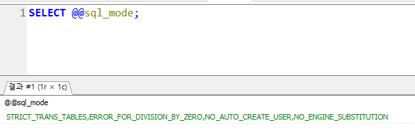

# sql_mode

sql mode는 mysql에 저장될 데이터에 대한 유호성 검사 범위를 설정하는 시스템 변수이다.

현재 접속중인 DB의 sql mode 확인하는 방법

```sql
SELECT @@sql_mode;
```



DB버전은 MariaDB 10.11 이고 설정값은 아래와 같다

**STRICT_TRANS_TABLES,ERROR_FOR_DIVISION_BY_ZERO,NO_AUTO_CREATE_USER,NO_ENGINE_SUBSTITUTION**

- **STRICT_TRANS_TABLES :** 이 모드가 활성화되면 트랜잭션 테이블에서 잘못된 데이터를 삽입하거나 업데이트할 때 오류가 발생합니다. 예를 들어, `NOT NULL` 컬럼에 `NULL` 값을 삽입하려 하면 오류가 발생합니다.
- **ERROR_FOR_DIVISION_BY_ZERO :** 0으로 나누기를 시도할 때 경고 대신 오류를 발생시킵니다.
- **NO_AUTO_CREATE_USER : 이 옵션은 [링크](https://dev.hi.ne.kr/no_auto_create_user/)를 확인!**
- **NO_ENGINE_SUBSTITUTION :** 지정된 저장 엔진이 사용할 수 없을 때, MySQL이 대체 엔진을 사용하지 않도록 합니다.

db버전을 업그레이드 하면 insert가 되지 않을텐데 그럼 **STRICT_TRANS_TABLES** 이 옵션때문에 안되는 경우가 많다..

### sql 모드 설정 및 변경

1. 영구적인 변경법
    
    MySQL 서버의 설정 파일인 `my.cnf` 또는 `my.ini` 파일에서 SQL 모드를 설정할 수 있습니다. 
    내 서버의 경우 경로는 /etc/my.cnf였다. vi /etc/my.cnf
    
    ```sql
    [mysqld]
    sql_mode="STRICT_TRANS_TABLES,NO_ZERO_IN_DATE,NO_ZERO_DATE,ERROR_FOR_DIVISION_BY_ZERO,NO_AUTO_CREATE_USER,NO_ENGINE_SUBSTITUTION"
    ```
    
    여기서 옵션을 넣고 빼면된다. 변경 사항 적용은 재시작 해주면 된다.
    

1. 세션별 sql 모드 설정
    
    세션별 sql모드 설정은 해당 세션이 종료되면 다시 원래 적용된 sql 모드로 돌아온다.
    
    ```sql
    SET sql_mode = 'STRICT_TRANS_TABLES,NO_ZERO_IN_DATE,NO_ZERO_DATE,ERROR_FOR_DIVISION_BY_ZERO,NO_AUTO_CREATE_USER,NO_ENGINE_SUBSTITUTION';
    ```
    
    set 명령어를 통해 모드 옵션을 지정해준다.
