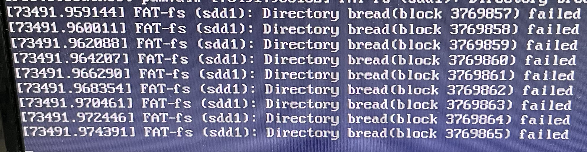

# mount(하드, usb 연결)

리눅스 시스템에서 마운트는 파일 시스템을 특정 디렉터리에 연결하는 프로세스를 의미함

usb를 연결해준다고 생각해주면 된다.

### **마운트 포인트 설정**

마운트 포인트… 그냥 usb 연결시 보여줄 폴더를 하나 만든다는 말이다.

```bash
sudo mkdir /mnt/mydrive
```

### **usb 경로 확인**

usb, 하드의 경로를 확인해준다. /dev/sdb 이런 형식이다. 용량이랑 이름으로 확인해 보면 된다.

```bash
fdisk -l
```

### 마**운트**

```bash
sudo mount /dev/sdb /mnt/mydrive
```

usb 경로 /dev/sdb를 생성한 마운트 포인트에 연결 해준다는 개념이다.

1. **마운트 확인**

```bash
df -h

# 설정한 마운트 포인트 경로로 가서 usb의 내용이 있는지로도 확인 가능하다.
```

### **마운트 해제**

마운트 해제는 마운트 포인트의 경로를 적어줘야 한다.

```bash
sudo umount /mnt/mydrive
```

가끔 umount 명령 실행시 target is busy라는 오류와 제대로 언마운트 되지 않는다.

```bash
umount -f -l /mnt/mydrive

# -f, --force : 강제로 마운트 해제합니다.
# -l, --lazy : 지연 마운트 해제합니다.(디스크 작업이 완료된 후)
```

옵션을 넣어 강제 언마운트 할 수 있다.

그렇지만 강제로 언마운트 보단 사용중인 프로세스가 있는지 확인 후 프로세스 종료 후 언마운트를 하자



안그러면 이런 오류 때문에 서버를 껐다 켜야한다 ㅜㅜ
