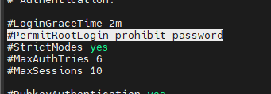

# U-01 root계정 접속 제한

## 취약점 개요

## 점검내용

시스템 정책에 root 계정의 원격 터미널 접속 차단 설정이 되어 있는지 점검

## 점검목적

관리자계정 탈취로 인한 시스템 장악을 방지하기 위해 외부 비인가자의 root 꼐정 접근 시도를 원천적으로 차단하기 위함

## 보안위협

root 계정은 운영체제의 모든 기능을 설정 및 변경이 가능하여(프로세스, 커널변경 등) root 계정을 탈취하여 외부에서 원격을 이용한 시스템 장악 및 각종 공격으로(무작위 대입공격) 인한 root 계정 사용 불가 위협

---

## 점검 및 조치

리눅스 기준

## 점검

```bash
**[Telnet]**
#cat /etc/pam.d/login

auth required /lib/security/pam_securetty.so

#cat /etc/securetty

pts/0 ~ pts/x 관련 설정이 존재하지 않음

**[SSH]**
#cat /etc/sshd_config

PermitRootLogin no
```

위의 제시한 내용으로 설정 되어 있을 경우 root 접속 차단된

## 조치

### **[Telnet 서비스 사용시]**

1.  “/etc/securetty” 파일에서 pts/0 ~ pts/x 설정 제거 또는, 주석 처리
2.  ****“/etc/pam.d/login” 파일 수정 또는, 신규 삽입

**(수정 전)** #auth required /lib/security/pam_securetty.so

**(수정 후)** auth required /lib/security/pam_securetty.so

※ /etc/securetty : Telnet 접속 시 root 접근 제한 설정 파일

“/etc/securetty” 파일 내 *pts/x 관련 설정이 존재하는 경우 PAM 모듈 설정과 관계없이 root

계정 접속을 허용하므로 반드시 "securetty" 파일에서 pts/x 관련 설정 제거 필요

### **[SSH 서비스 사용시]**

Step 1) vi 편집기를 이용하여 “/etc/ssh/sshd_config” 파일 열기

Step 2) 아래와 같이 주석 제거 또는, 신규 삽입

(수정 전) #PermitRootLogin Yes

(수정 후) PermitRootLogin No

---

### 내 서버 조치

Rocky Linux

```bash
sudo cat "/etc/ssh/sshd_config"

# 점검 방법에 나온 경로와 다르다
```



**prohibit-password**: Key 파일을 사용해서만 로그인이 가능. 일반적인 로그인방법은 X

💡 서버를 설정하는 과정에서 설치 옵션을 통해 r**oot 계정 접근을 제한하면 훨씬 편리하다**. 이러한 접근 제한은 보안 측면에서 매우 중요하며, 부적절한 접근으로 인한 잠재적인 위협을 사전에 방지할 수 있다. 따라서, 서버 설정 과정에서는 이러한 세부 사항에 주의를 기울여야 한다.
