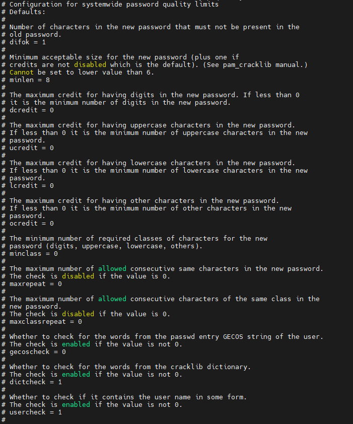

# U-02 패스워드 복잡성 설정

## 취약점 개요

## 점검내용

시스템 정책에 사용자 계정(root및 일반계정 모두 해당) 패스워드 복잡성 관련 설정이 되어 있는지 점검

## 점검목적

패스워드 복잡성 관련 정책이 설정되어 있는지 점검하여 비인기자의 공격(무작위 대입 공격, 사전 대입 공격 등) 에 대비가 되어 이는지 확인하기 위함

## 보안위협

복잡성 설정이 되어있지 않는 패스워드는 사회공학적인 유추가 가능 할 수 있으며 암호화됨 패스워드 해시값을 무작위 대입공격, 사전대입공격등으로 단시간에 패스워드 크렉이 가능함

---

## 점검 및 조치

점검

패스워드 복잡성 설정 파일 확인

```bash
sudo cat /etc/security/pwquality.conf
```

| 권장 값 | 기능 | 설명 |
| --- | --- | --- |
| lcredit=-1 | 최소 소문자 요구 | 소문자 최소 1자 이상 요구 |
| ucredit=-1 | 최소 대문자 요구 | 최소 대문자 1자 이상 요구 |
| dcredit=-1 | 최소 숫자 요구 | 최소 숫자 1자 이상 요구 |
| ocredit=-1 | 최소 특수문자 요구 | 최소 특수문자 1자 이상 요구 |
| minlen=8 | 최소 패스워드 길이 설정 | 최소 8자리 이상 설정 |
| difok=N | 기존 패스워드와 비교 | 기본값 10(50%) |

**< 부적절한 패스워드 유형 >**

1. 사전에 나오는 단어나 이들의 조합

2. 길이가 너무 짧거나, NULL(공백)인 패스워드

3. 키보드 자판의 일련의 나열 (예) abcd, qwert, etc

4. 사용자 계정 정보에서 유추 가능한 단어들

(예) 지역명, 부서명, 계정명, 사용자 이름의 이니셜, root, rootroot, root123, admin등

**< 패스워드 관리 방법 >**

1. 영문, 숫자, 특수문자를 조합하여 계정명과 상이한 8자 이상의 패스워드 설정

※ 다음 각 목의 문자 종류 중 2종류 이상을 조합하여 최소 10자리 이상 또는, 3종류 이상을

조합하여 최소 8자리 이상의 길이로 구성

가. 영문 대문자(26개)

나. 영문 소문자(26개)

다. 숫자(10개)

라. 특수문자(32개)

2. 시스템마다 상이한 패스워드 사용

3. 패스워드를 기록해 놓을 경우 변형하여 기록

---

### 내 서버 적용

```bash
sudo cat "/etc/security/pwquality.conf"
```



점검 결과 해당값이 권장 값과 다름

권장 값으로 수정 후 적용하면 된다.
