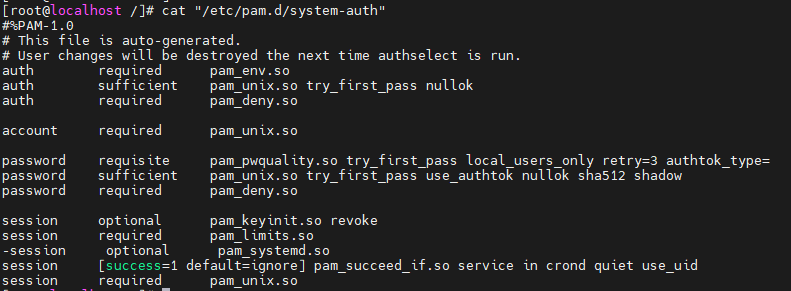

# U-03 계정 잠금 임계값 설정

## 취약점 개요

## 점검내용

사용자 계정 로그인 실패 시 계정잠금 임계값이 설정되어 있는지 점검

## 점검목적

계정찰취 목적의 무작위 대입 공격 시 해당 계정을 잠금하여 인증 요청에 응답하는 리소스 낭비를 차단하고 대입 공격으로 인한 비밀번호 노출 공격을 무력화하기 위함

## 보안위협

패스워드 탈취 공격(무작위 대입 공격, 사전 대입 공격, 추측 공격 등)의 인증 요청에 대해 설정된 패스워드와 일치 할 때까지 지속적으로 응답하여 해당 계정의 패스워드가 유출 될 수 있음

---

## 점검 및 조치

점검

```bash
sudo cat /etc/pam.d/system-auth
```

1. vi 편집기를 이욯아여 “/etc/pam.d/system-auth” 파일 열기
2. 아래와 같이 수정 또는, 신규 삽입

```bash
auth required /lib/security/pam_tally.so deny=5 unlock_tme=120
no_magit_root
account required /lib/security/pam_tally.so no magic_root reset
```

| 옵션 | 설명 |
| --- | --- |
| no_magic_root | root 계정에게는 패스워드 잠금 설정을 적용하지 않음 |
| deny=5 | 5회 입력 실패 시 패스워드 잠금 |
| reset | 접속 시도 성공 시 실패한 횟수 초기화 |

---

### 내 서버 적용

```bash
sudo cat /etc/pam.d/system-auth
```



점검 결과 파일 내용이 다름

로키리눅스 8버전 부터 설정파일을 수동으로 변경하기보다 명령어를 통해 변경하는것을 권장

```bash
auth reqiured pam_faillock.so.preauth silent audit deny=5 unlock_tme=120
```
