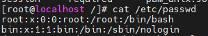

# U-04 패스워드 파일 보호

## 취약점 개요

## 점검내용

시스템 사용자 계정(root, 일반계정) 정보가 저장된 파일에 사용자 계정 패스워드가 암호화되어 저장되어 있는지 점검

## 점검목적

일부 오래된 시스템의 경우 /etc/passwd 파일에 패스워드가 평문으로 저장되므로 사용자 계정 패스워드가 암호화 되어 저장되어있는지 점검하여 비인가자의 패스워드 파일 접근 시에도 사용자 계정 패스워드가 안전하게 관리되고 있는지 확인하기 위함

## 보안위협

사용자 계정 패스워드가 저장된 파일이 유출 또는 탈취 시 평문으로 저장된 패스워드 정보가 노출될수 있음

---

## 점검 및 조치

점검

1. shadow 파일의 패스워드 암호화 존재 확인(일반적으로 /etc 디렉터리 내 존재

```bash
ls /etc
```

1. /etc/passwd 파일 내 두 번쨰 필드가 “x” 표시되는지 확인

```bash
cat /etc/passwd

root:x:0:0:r00t:/root:/bin/bash
```

---

### 내 서버 적용

```bash
cat /etc/passwd
```



x가 되어 있다..
