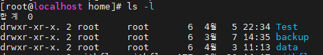
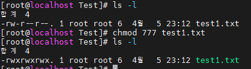

# 파일 및 디렉토리 권한 설정

## 파일, 디렉토리 권한 확인

```jsx
ls -l
```

해당 명령어로 조회 시 다음과 같다!!



**drwxr-xr-x. 2 root     root       6  4월  5 22:34 Test
drwxr-xr-x. 2 root     root       6  3월  7 14:35 backup
drwxr-xr-x. 2 root     root       6  4월  3 11:13 data**

**출력결과 설명**

d : 파일 유형 종류, 조회목록 모두 디렉토리

rwxr-xr-x : 권한, 허가권

2 : 링크 수

root : 소유자

root : 소유자 그룹 (리눅스에선 기본적으로 사용자와 동일한 이름의 그룹을 만든다)

6 : 사이즈

4월 5 22:34 : 마지막 수정일

Test : 이름

## 파일 유형 종류

| 문자 | 설명 |
| --- | --- |
| d | 디렉토리 |
| b | 불록 디바이스 파일 (하드 드라이브나 CD-ROM 같이 블록 단위의 데이터를 처리하는 디바이스) |
| c | 문자 디바이스 파일(터미널과 모뎀같이 바이트의 열로 데이터를 처리하는 디바이스) |
| l | 심볼릭 링크 파일 |
| p | 명명된 파이프(Named Pipe) |
| s | 유닉스 도메인(Socket) |
| - | 일반(정규) 파일 |

## 권한

ls -l 명령어로 권한 조회 했을 시 rwxr-xr-x 을 볼 수 있다. 이 권한을 읽는 방법은 먼저 3마디씩 자른다

**rwx / r-x / r-x** 

이 세개씩 순서대로 **사용자(소유자)권한 / 그룹 권한 / 다른 사용자 권한** 으로 볼 수 있다

r w x 는 각각 읽기(read), 쓰기(write), 실행(execute) 권한을 나타낸다

이제 그럼 저 권한을 해석 할 수 있다

**첫번째 rwx는 사용자(소유자) 에게 읽기, 쓰기, 실행 권한이 있다는 것이다**

**두번째 r-x는 그룹 권한에게 읽기, 실행 권한이 있다는 것이다**

**세번째 r-x 는 다른 사용자에게 읽기, 실행 권한이 있다는 것이다**

권한은 8진법으로 나타낼 수 있다

**r(읽기)  : 4**

**w (쓰기) : 2**

**x (실행) : 1**

다시 위의 권한을 8진법으로 표현하면

**첫번째 rwx는 7**

**두번째 r-x는 5**

**세번째 r-x 는 5**

## 권한 변경

파일이나 디레고리의 권한을 변경하기 위해서는 chmod 명령어를 이용해야한다.

chmod에는 여러 옵션이 있다

```
읽기 r
쓰기 w
실행 x

권한 추가 +
권한 삭제 -
권한 지정 =

사용자 허가권 u
그룹 허가권 g
다른사용자 허가권 o
모두 a
```

위의 기호들을 조합하여 권한을 변경 할 수 있다

```bash
chmod u=rw file.txt : file.txt에 대하여 사용자가 읽기, 쓰기 권한 지정

chmod a=rw file.txt : file.txt에 대해여 모두에게 읽기, 쓰기 권한을 지정

chmod g-w file.txt : file.txt에 대하여 그룹에게 쓰기 권한을 삭제
```

근데 기호로 할려면 상당히 복잡하다…

그래서 8진법을 이욯한다

```bash
chmod -R 777 folder : 디렉터리 이하의 모든 파일과 디렉터리에 대하여 모두에게 모든 권한 부여

chmod -R 751 folder : 사용자에겐 읽기, 쓰기, 실행 그룹에겐 읽기, 실행 다른 사용자에겐 실행 부여
```



777 권한을 부여하였다!

## 파일 소유권 변경

chown 명령을 사용하면 파일, 디렉토리의 사용자, 그룹을 변경 할 수 있다.

```bash
chown yerim file.txt : 사용자를 yerim 으로 변경한다.

chgrp yerim test.txt : 파일의 그룹을 yerim으로 변경한다

chown yerim.yerim test.txt : 사용자와 파일의 그룹을 yerim으로 변경한다

chown -R yerim test/ : 디렉토리와 그 안에 있는 모든 파일의 사용자를 yerim으로 변경한다 
```
