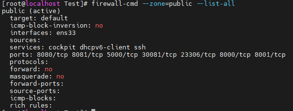
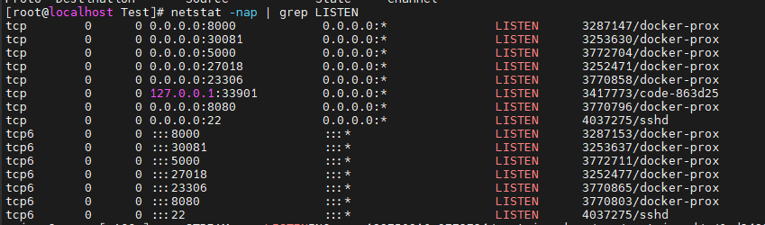
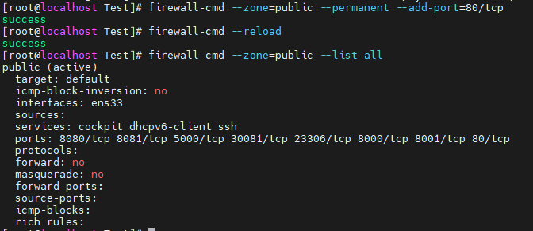
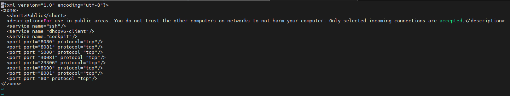

# 포트, 방화벽 확인 및 오픈

centos7, rockyLinux 기준

서버에 프로젝트를 올리고 접속하면 아마 안될 확률이 높다. 특히 mysql 외부접속 안되는것…

그 중 하나가 포트가 안열려있어서 접속이 안되는 경우이다..! 

---

### 열린 포트 확인

```bash
firewall-cmd --zone=public --list-all
```



내 서버 열린 포트

ports에서 열린 포트들 확인 가능하다 테스트 용으로 사용하고 있는 서버라 많은 포트들이 열려있다.

firewall 명령어가 아닌 netstat으로도 확인 가능하다

```bash
netstat -nap | grep LISTEN

-n: host명으로 표시 안함 
-a: 모든소켓 표시 
-p: 프로세스ID와 프로그램명 표시 
```



해당 포트를 어떤 프로세스에서 사용중인지 확인가능하다

### 포트 열기

이제 새로운 포트를 추가해 보겠다. 80포트를 추가해 보자

```bash
firewall-cmd --zone=public --permanent --add-port={Post 번호}/tcp

firewall-cmd --zone=public --permanent --add-port=80/tcp
```

열고 싶은 포트 번호만 적어주면 된다 하지만 명령어만 적어서 끝나는게 아니다 

```bash
firewall-cmd --reload
```

reload를 해줘야 적용이 된다



성공적으로 80포트가 오픈되었다!!

xml파일을 수정하여 오픈하는 방법도 있다

```bash
vi /etc/firewalld/zones/public.xml
```

해당 경로의 public.xml파일에서 직접 추가하면 된다. 이 파일을 열게 되면 명령어로 확인하였던 오픈된 포트들을여기서도 확인 가능 하다.



**<port port =”포트번호” protocol=”프로토콜”/>** 형식으로 추가해 주면 된다.

파일을 수정해서 포트를 여는것도 **reload**를 해줘야 정상적으로 적용된다.

아래 포트 목록 참고!!

[TCP/UDP의 포트 목록](https://ko.wikipedia.org/wiki/TCP/UDP의_포트_목록)
