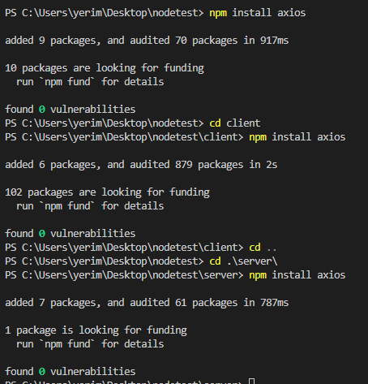
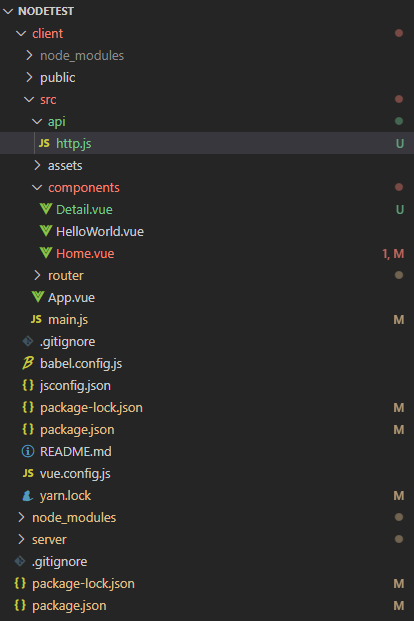
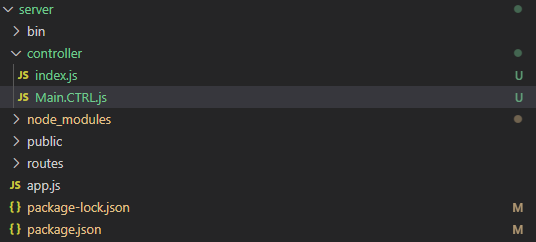
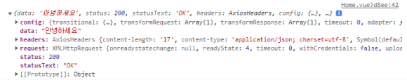

# Axios로 api 통신하기

[시작하기 | Axios Docs](https://axios-http.com/kr/docs/intro)

axios는 node.js와 브라우저를 위한 http 통신 라이브러리

### 설치

```jsx
npm install axios
```



다 install 해준다

2. axios 인스턴스 생성하기, api 호출 파일 만들기



client에 api 폴더를 만들어서 모아두었다

```jsx
import axios from 'axios';

const instance = axios.create({
baseURL: '서버주소'
});

export default instance;
```

http.js 파일 생성 인스턴스를 생성하고 내보낸다

baseURL은 로컬에서 하는거면 너님 ip적고 포트 지정해주면 된다.

ex)[http://각자아이피:5000](http://xn--p39a229b9qbfdw47e:5000/)

```jsx
import http from './http';

export async function getData(){
	return http.get('/api/getData');
}
```

axios 인스턴스를 임포트해줌, get 요청하는 함수를 하나 만들어 준다

### server와 통신



이제 client에서 호출한 api를 처리하기 위해 server로 이동

controller폴더를 만들어 관리해 처리해주기

```jsx
"use strict";
const express = require("express");
const router = express();

const main_ctrl = require("./Main.CTRL");

router.get("/api/getData", main_ctrl.getData);

router.get('/', (req, res) => {
    res.send('404 . Not Found!')
})

module.exports = router;
```

index.js 파일 생성하기(분리된 라우터)

앞에서 get으로 요청 보냈으니 router.get으로 써줘야함

요청을 처리할 컨트롤러 파일도 임포트 해준다.

```jsx
const getData = async (req, res) => {
    return res.json("안녕하세요");
}

module.exports = {
    getData
};
```

Main.CTRL.js 아직 db 연결 안했으니 return 값만 임시로 적어주기

```jsx
var express = require('express');
var path = require('path');
var cookieParser = require('cookie-parser');
var logger = require('morgan');

const routes_path = require("./controller");
const cors = require('cors');

var app = express();

app.use(logger('dev'));
app.use(express.json());
app.use(express.urlencoded({ extended: false }));
app.use(cookieParser());
app.use(express.static(path.join(__dirname, 'public')));
app.use(cors()) //이거
app.use('/', routes_path);

//서버실행
app.listen(5000,  () =>{
    console.log("Start Server");
  });

module.exports = app;

```

이제 app.js 파일로 가서 router 아까 생성한 라우터 파일을 연결 const routes_path = require("./controller");

사용한다고 app.use('/', routes_path);도 써주기

근데 자꾸 오류나서 보니까 cors를 안해줌

[교차 출처 리소스 공유 (CORS) - HTTP | MDN](https://developer.mozilla.org/ko/docs/Web/HTTP/CORS)

cors가 먼지는 참고하세요

아무튼 install 해주고 진행하기

다 저장하고 실행해준다



잘 받아옴
