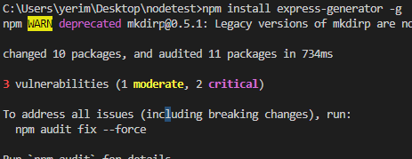
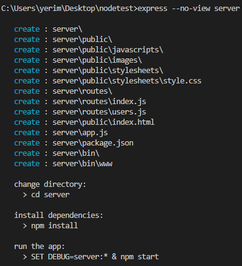
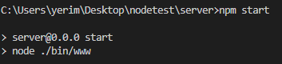
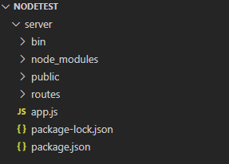

# express 서버 구성

## 익스프레스 프로젝트 생성

```jsx
npm install express-generator -g
```

제너레이터를 이용해 손쉽게 설정 install 해주기



```jsx
express --no-view server
```

server폴더 생성

view옵션 ejs와 pug가 있음

**server로 쓸꺼니 no view 설정**



생성한 파일로 이동하기 (cd server)

모듈 설치 (npm install)



npm start로 실행

3000번포트로 이동하여 확인하기

[http://본인아이피:3000/](http://192.168.210.122:3000/)


정상적으로 접속되는지 확인



구조 확인
