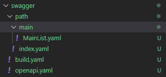
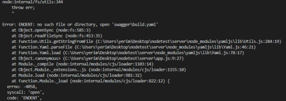
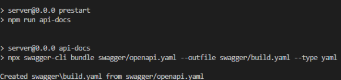
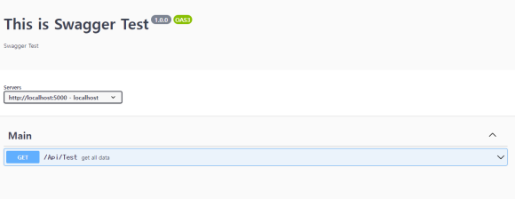

# Express에 Swagger 적용하기

## Swagger란?

[API Documentation & Design Tools for Teams | Swagger](https://swagger.io/)

API 문서를 자동으로 정리해주는 것

프론트 개발자와 백엔드 개발자가 서로 소통하기 위한 문서!!

### 설치

```jsx
npm install swagger-cli swagger-ui-express yamljs
```

swagger-cli : api docs를 검증하고 하나의 파일로 합쳐주는 역할

swagger-ui-express : 작성한 파일을 읽어서 swagger-ui로 변환, swagger페이지

생성

yamljs : yaml파일을 읽어오기 위해 사용

나는 swagger 파일들을 따로 분리하여 관리할것이기 때문에 yamljs를 설치해준다!

### 구현



서버쪽에 swagger 폴더를 만들어 준다

openapi.yaml은 기본 옵션 파일이므로 없어서는 안된다

**build.yaml은 자동생성되는 파일이다**

path 폴더를 만들어서 각각 주소별로 또 개별 파일을 만들어서 관리를 해주겠다

**openapi.yaml**

```yaml
openapi: "3.0.0"
info:
  version: 1.0.0
  title: This is Swagger Test
  description: Swagger Test
servers:
  - description: localhost
    url: http://localhost:5000
paths:
  $ref: "./path/index.yaml"
```

paths는 path 폴더안에 있는 index를 불러와 사용

**path/index.yaml**

```yaml
#메인
/Api/Test:
  $ref : "main/MainList.yaml"
```

index파일에 주소를 정의한다. $ref는 그 api에 해당하는 상세내용을 불러와준다.

**path/main/MainList.yaml**

```yaml
get:
  tags:
    - Main
  summary: get all data
  description:
  responses:
    200:
      description: OK
      content:
        application/json:
          schema:
            type: array
            items:
              type: object
              properties:
                district_code:
                  type: string
                district_name:
                  type: string
                parent_code:
                  type: string
```

상세내용을 적어준다.

다 적어준 다음 app.js로 가서 swagger를 사용해준다고 정의해주자

```jsx
var express = require('express');
var path = require('path');
var cookieParser = require('cookie-parser');
var logger = require('morgan');

var swaggerUi = require("swagger-ui-express");//
var YAML = require("yamljs");//

const swaggerSpecs = YAML.load(path.join("./swagger/build.yaml"))//

const routes_path = require("./controller");
const cors = require('cors');

var app = express();
app.use("/api-docs", swaggerUi.serve, swaggerUi.setup(swaggerSpecs))//
app.use(logger('dev'));
app.use(express.json());
app.use(express.urlencoded({ extended: false }));
app.use(cookieParser());
app.use(express.static(path.join(__dirname, 'public')));
app.use(cors())
app.use('/', routes_path);

app.listen(5000,  () =>{
    console.log("Start Server!!!!!!!!!!!");
  });

module.exports = app;

```

오른쪽에 주석표시가 달린것들을 추가해준다

/api-docs는 openapi에서 지정해준 url 뒤에 붙이면 swagger 주소가 된다.

그러고 서버시작해주면..



오류가 난다. 그 이유는 아직 build.yaml이 없기때문

build.yaml은 자동생성되는 파일인데 이제 자동생성이 될 수 있도록 명령어 하나 쳐준다.

참고로 build.yaml파일로 swagger ui 및 기능을 만들어내기 때문에 없으면 안됨...

```jsx
npx swagger-cli bundle swagger/openapi.yaml --outfile swagger/build.yaml --type yaml
```

설치된 파일단에서 해당 명령어 입력해준다. 그럼 build.yaml파일이 생성된다



그러고 다시 서버를 실행하고 정의한 주소로 들어가주면



swagger가 생겼다
