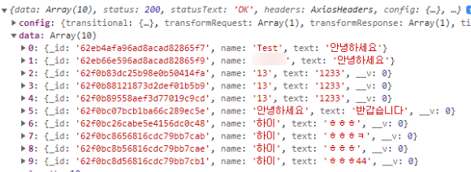
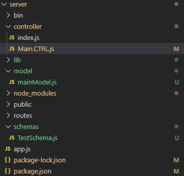

# MongoDB 연결

```jsx
npm install mongoose
```

먼저 서버쪽에 mogoose를 설치해준다.

```jsx
var mongoose = require('mongoose');

var db = mongoose.connect('mongodb://localhost:27017/Test')
    .then(()=>{
        console.log('Database connection successful!');
    })
    .catch((err) => {
        console.log('Database connection error : '+ err);
    })

module.exports = db;
```

몽고DB와 연결하는 database.js 파일을 생성해준다

DB는 이전에 만들어 둔게 있었음

```jsx
const mongoose = require('mongoose');
const Schema = mongoose.Schema;

const TestSchema = new Schema({
    name:{
        type : String
    },
    text:{
        type: String
    }
},{
    versionKey: false
})

const Test = mongoose.model('Test', TestSchema, "Test");
module.exports = Test;
```

스키마 파일을 생성해줍니다. 파일 이름은 TestSchema.js 제 몽고db에 있는 컬렉션 이름이에요

스키마를 만드는 이유는...

몽구스는 사용자가 작성한 스키마를 기준으로 데이터를 넣기전에 미리 검사를 한다.

만약 어긋나는 데이터가 있으면 오류 발생. 테이블과 비슷하다고 보면 된다.

그냥 테이블이라고 생각해라

```jsx
"use strict";
const e = require('express');
const db = require('../lib/database');
const Test = require('../schemas/TestSchema');

exports.getData = async function(req,res){
    Test.find().then(result => {
        res.json(result);
    })
    .catch(err => {
        console.log(err);
    })
}

exports.addData = async function(req, res){

    var newData = new Test();

    newData.name = req.name;
    newData.text = req.text;

    newData.save().then(result => {
        return res.json(result);
        // console.log(result);
    })
    .catch(err => {
        return res.json(err);
    })

}

exports.deleteData = async function(req, res){
    Test.findOneAndDelete({ _id: req.body._id }).then(result => {
        return res.json(result);
    })
    .catch(err => {
        return res.json(err);
    })
}

exports.updateData = async function(req, res){
    const filter = {_id : req.body.id};
    const update = {name : req.body.name, text : req.body.text};

    Test.findByIdAndUpdate(filter, update).then(result => {
        return res.json(result);
    })
    .catch(err => {
        return res.json(err);
    })
}
```

다음은 mainModel.js 파일을 만들어준다.

기본적인 CRUD 기능을 만들어주었다.

```jsx
const main = require("../model/mainModel");

const getData = async (req, res) => {
    const result = await main.getData(req, res);
}

module.exports = {
    getData
};
```

이제 어제 만들어둔 Main.CTRL.js에 모델을 정의해주고 값을 한번 가져와보자..



잘 가져 온다.^^



서버쪽 파일 구조
