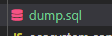

# Node.js에서 mysql db 백업

mysqldump를 사용해서 db 백업파일을 만드는 방법

내가 한 방법은 node.js 코드에서 백업 방법이다.

참고사이트

[https://stackoverflow.com/questions/30921435/node-js-backup-mysql-database](https://stackoverflow.com/questions/30921435/node-js-backup-mysql-database)

### **1. 모듈 설치**

`npm install mysqldump`

### **2. import및 코드 작성**

```jsx
import * as mysqldump from "mysqldump";

mysqldump.default({
    connection: {
        host: 'db host',
        port: 포트,
        user: 'root',
        password: '비밀번호',
        database: '백업할 db이름',
    },
    dumpToFile: './dump.sql', //생성할 파일 명과 루트를 지정
})
```

위의 코드를 작성해 준다.

나는 테스트 할거라서 그냥 실행할때 한번 보려고 server의 index.js(app.use.. 있는 파일임)에 넣어 줬다

그리고 연결할 db의 포트가 기본 3306이라면 포트는 적어주지 않아도 된다!!

내가 연결할 db는 포트가 3306이 아니라 적어 줬음

그리고 프로젝트 실행



지정한 경로로 백업 파일이 생겼다

node.js의 노드 스케쥴러를 함께 이용해서 정해진 시간에 자동으로 백업하게도 가능 할 것 같다.

하지만 소스코드 상에서 말고 서버에서 shell script를 작성하여 crontab으로 스케쥴링 하는방법도 있다.
