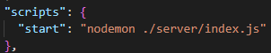
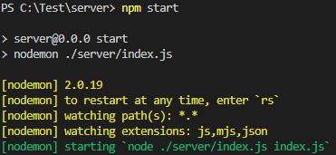

# nodemon 설정

[npm: nodemon](https://www.npmjs.com/package/nodemon)

**Nodemon은** 파일이 수정되었을때 서버를 자동으로 restart 해준다

package.json 파일의 script안에 명령어 수정

**npm start 로 실행**

파일 수정후 저장시 서버 restart

server와 client로 프론트 백 나눌시 **nodemon은 server쪽에 설치**
