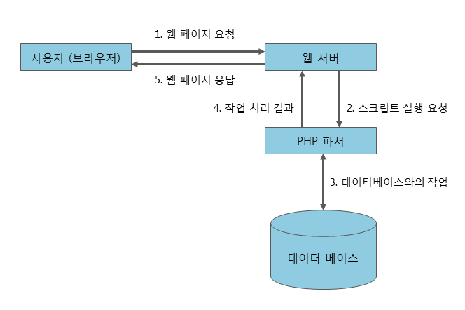

# PHP

## PHP란?

**Personal Home Page Tools**

C언어를 기반으로 만들어진 서버 측에서 실행되는 서버 사이드 스크립트 언어

PHP의 이름에서 보이듯이 **개인 홈페이지를 쉽게 만들기 위해 생성된 툴** & **웹개발에 특화**된 언어

### 장점

1. **오픈소스이다.**  개발 및 유지 보수 비용을 절감하는 데 도움이 된다.
2. **진입장벽이 낮다.** 다른 프로그래밍 언어에 비해 문법을 익히는게 어렵지 않다. 레퍼런스도 어렵지 않게 찾을 수 있다. 나도 어렵지 않게 시작할 수 있었다…
3. **유연성이 좋다.** PHP는 다양한 운영 체제와 웹 서버에서 동작할 수 있고 다른 언어와의 통합도 용이하다. 이는 PHP로 다양한 종류의 웹 애플리케이션을 개발할 수 있음을 의미

### 단점

1. **보안에 취약하다.** PHP는 초기에 보안 취약점이 많았으며, 이는 여전히 일부 라이브러리나 코드에서 발견될 수 있다. 그래서 JSP나 ASP.NET으로 대체되고 있다.
2.  **코드 유지 관리가 어렵다.** PHP는 초기에는 코드가 조직화되지 않고 유지보수가 어려울 수 있다. 특히 큰 프로젝트의 경우 코드의 가독성과 유지보수성을 유지하는 것이 중요함

---

### PHP 동작 원리

---

### PHP 프레임워크

1. **Laravel**: Laravel은 현재 가장 인기 있는 PHP 프레임워크 중 하나로, 강력한 기능과 직관적인 구문을 제공함 라라벨은 **MVC 패턴 기반이며** 라우팅, 데이터베이스 마이그레이션, 인증, 템플릿 엔진 등을 포함한 다양한 기능을 제공한다.node 패키지 매니저인 **npm을 활용**하여 개발에 엄청난 편의를 준다.
2. **CodeIgniter**: CodeIgniter는 빠르고 가벼운 PHP 프레임워크로, 초보자부터 전문가까지 다양한 개발자에게 인기가 있다. 작은 규모의 프로젝트부터 중간 규모의 프로젝트까지 다양한 종류의 애플리케이션을 개발할 수 있다. **MVC 패턴을 기반**으로 두고있다

[CodeIgniter User Guide — CodeIgniter 3.1.13 documentation](https://www.codeigniter.com/userguide3/)

[Laravel - The PHP Framework For Web Artisans](https://laravel.com/docs/11.x/starter-kits)

나는 이 둘 중 코드 이그나이터 프레임 워크를 사용했다. 실무에서 사용하던 프레임워크라 익숙했다.
