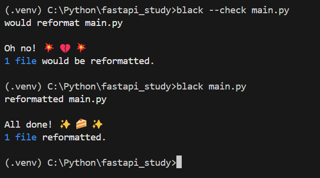

# Black 코드 스타일 자동화

[Black 25.1.1.dev27 documentation](https://black.readthedocs.io/en/latest/)

이번에 파이썬 코드 정비를 하게 되면서 **Black** 코드 포맷팅을 이용하기로 했다.

1. 설치
    
    ```python
    pip install black
    ```
    

1. 사용법
    
    ```python
    black main.py
    ```
    
    사용법은 간단하다 원하는 파일을 지정해주면 된다.
    
    ```python
    black --check main.py
    ```
    
    check option을 통해 포맷팅이 필요한지 아닌지 알 수 있다.
    
    
    
    ```python
    black .
    ```
    
    모드 파일을 포맷팅 하려면 위의 명령어 사용!!
    

[Black Playground](https://black.vercel.app/?version=stable&state=_Td6WFoAAATm1rRGAgAhARYAAAB0L-Wj4ASJAnldAD2IimZxl1N_WlkPinBFoXIfdFTaTVkGVeHShArYj9yPlDvwBA7LhGo8BvRQqDilPtgsfdKl-ha7EFp0Ma6lY_06IceKiVsJ3BpoICJM9wU1VJLD7l3qd5xTmo78LqThf9uibGWcWCD16LBOn0JK8rhhx_Gf2ClySDJtvm7zQJ1Z-Ipmv9D7I_zhjztfi2UTVsJp7917XToHBm2EoNZqyE8homtGskFIiif5EZthHQvvOj8S2gJx8_t_UpWp1ScpIsD_Xq83LX-B956I_EBIeNoGwZZPFC5zAIoMeiaC1jU-sdOHVucLJM_x-jkzMvK8Utdfvp9MMvKyTfb_BZoe0-FAc2ZVlXEpwYgJVAGdCXv3lQT4bpTXyBwDrDVrUeJDivSSwOvT8tlnuMrXoD1Sk2NZB5SHyNmZsfyAEqLALbUnhkX8hbt5U2yNQRDf1LQhuUIOii6k6H9wnDNRnBiQHUfzKfW1CLiThnuVFjlCxQhJ60u67n3EK38XxHkQdOocJXpBNO51E4-f9z2hj0EDTu_ScuqOiC9cI8qJ4grSZIOnnQLv9WPvmCzx5zib3JacesIxMVvZNQiljq_gL7udm1yeXQjENOrBWbfBEkv1P4izWeAysoJgZUhtZFwKFdoCGt2TXe3xQ-wVZFS5KoMPhGFDZGPKzpK15caQOnWobOHLKaL8eFA-qI44qZrMQ7sSLn04bYeenNR2Vxz7hvK0lJhkgKrpVfUnZrtF-e-ubeeUCThWus4jZbKlFBe2Kroz90Elij_UZBMFCcFo0CfIx5mGloKoK10y5eFtrgIZy3gUg3-VibDzoc8fXF63NR9AgKYXS1NQPXDXEwAAAABk7Jx28oPV2QABlQWKCQAAjbEry7HEZ_sCAAAAAARZWg==)

위 경로에서 black 포맷팅 샘플 확인 가능
