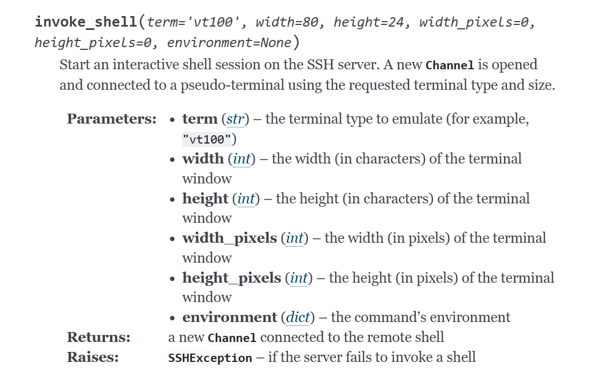

# paramiko - invoke_shell()

[Client — Paramiko  documentation](https://docs.paramiko.org/en/stable/api/client.html)

SSH 서버에서 대화형 셸 세션을 시작합니다. [**`Channel`**](https://docs.paramiko.org/en/stable/api/channel.html#paramiko.channel.Channel) 요청된 터미널 유형과 크기를 사용하여 새 터미널이 열리고 가상 터미널에 연결됩니다.

**invoke_shell은 하나의 세션에서 여러가지 명령어를 실행하는 경우 명령 간 맥락이 이어지는 경우 사용한다.**

예를들어서 `sudo su` 명령어 다음 패스워드 입력등… 

```python
shell = client.invoke_shell()
shell.send('sudo su\n')
shell.send('YOUR_PASSWORD\n')  # 패스워드 입력
```

ssh 로그인 후 터미널 세션을 여는것과 유사하다. putty가 하나 열린다 생각하면 된다

한줄씩 명령을 보내고 출력을 실시간으로 받아올 수 있다.

```python
def send_commands(shell, commands):
    for cmd in commands:
        shell.send(cmd + '\n')
        time.sleep(1)  # 각 명령어 실행 대기

    output = shell.recv(65535).decode()
    return output

commands = [
    "configure terminal",
    "interface ethernet 0/1",
    "ip address 192.168.1.1 255.255.255.0",
    "exit",
    "exit",
    "write memory"
]

client = paramiko.SSHClient()
client.set_missing_host_key_policy(paramiko.AutoAddPolicy())
client.connect(hostname='192.168.0.10', username='admin', password='YOUR_PASSWORD')

shell = client.invoke_shell()
time.sleep(1)  # 셸 준비

result = send_commands(shell, commands)
print(result)

shell.close()
client.close()
```

간단히 작성하면 이렇게 사용 가능하다. 

참고로 단일 명령어만 처리한다면 `exec_command`를 이용하면 된다.



paramiko 관련 내용은 공식 문서에 잘 정리 되어 있으니 꼭 참고
