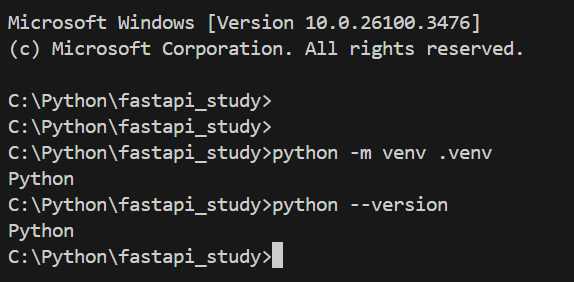
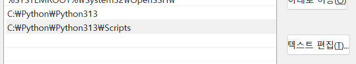
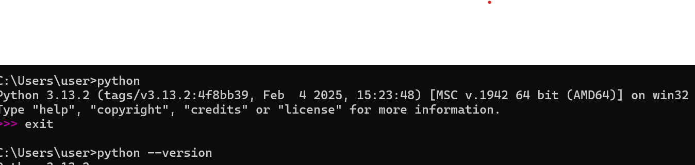

# python 명령어 입력시 python 출력만 되는 오류

새로운 작업 환경에서 pyhthon 설치 후 python —version이나 install을 하면 Python 만을 리턴한다.

너무너무 귀찮음 ㅡㅡ 환경변수를 설정해 주면된다

파이썬 설치경로와 그 안의 Scripts 파일을 경로로 잡아주고 재부팅을 했는데도

..

[[Etc] cmd 창에서 파이썬이 실행이 안될 때](https://yujinni-coding.tistory.com/84)

찾아보니 앱 실행 별칭을 꺼주면 된다하더라

드디어 적용이 되었다.
