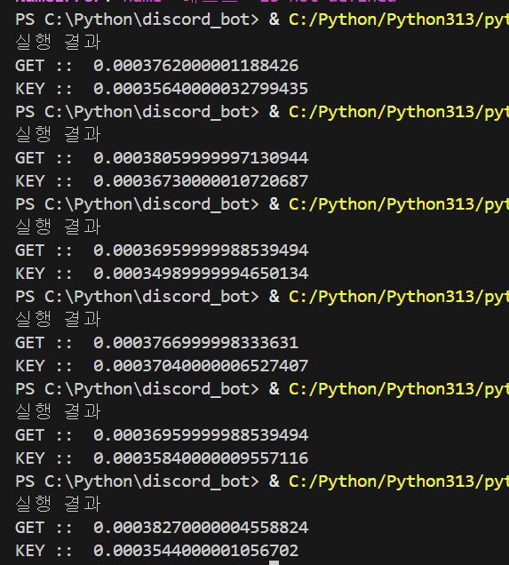
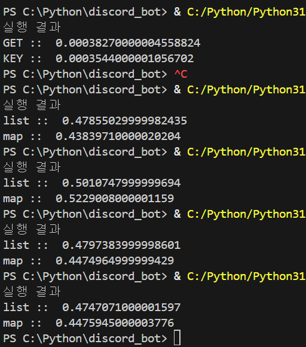

# timeit 실행시간 측정

[timeit — Measure execution time of small code snippets](https://docs.python.org/ko/3.13/library/timeit.html)

코드 일부분의 실행 시간을 측정할 수 있다.

```python
import timeit
```

평소대로라면 time 을 import 하여 종료시간에서 시작시간을 빼서 측정했는데 이 모듈은 코드 한줄씩 측정이 가능하다

한가지 측정해보고 싶은게 있는데. dict 에서 get이 빠른지 그냥 key로 접근해서 가져오는게 빠른지 timeit으로 확인

```python
import timeit

sampleData = {
    "id": 1,
    "name": "테스트",
    "age": 30,
    "email": "test@example.com",
    "is_active": True,
    "balance": 10500.75,
    "tags": ["python", "developer", "test"],
    "address": {
        "city": "서울",
        "district": "강남구",
        "zipcode": "12345"
    },
    "orders": [
        {"order_id": 101, "amount": 25000, "status": "completed"},
        {"order_id": 102, "amount": 15000, "status": "pending"},
        {"order_id": 103, "amount": 32000, "status": "canceled"},
    ],
    "settings": {
        "theme": "dark",
        "notifications": True,
        "language": "ko"
    }
}

dictGet = timeit.timeit(lambda: sampleData.get("name"), number=10000)
dictKey = timeit.timeit(lambda: sampleData["name"], number=10000)

print("실행 결과")
print("GET :: ", dictGet)
print("KEY :: ", dictKey)

```

- `timeit.timeit()`은 실행할 코드를 문자열 또는 함수로 받아야 한다.
- `sampleData.get(”name”)`은 “테스트” 라는 문자열을 반환 하므로 측정할 수가 없다.
- **람다 함수**로 감싸주면, 실행할 때마다 새로 호출되어 제대로 측정 가능
- `number=10000`은 측정할 소스코드를 1000번 실행한다는 의미, 여러번 측정하여 평균 시간을 계산

위 소스코드를 실행해보니



비슷한데 get 보단 key 접근이 살짝 빠르다. 신기

---

다음은 리스트 컴프리헨션과 그냥 map

```python
import timeit

code1 = "[str(n) for n in range(1000)]"
code2 = "list(map(str, range(1000)))"

listTime = timeit.timeit(code1, number=10000)
mapTime = timeit.timeit(code2, number=10000)

print("실행 결과")
print("list :: ", listTime)
print("map :: ", mapTime)
```



얘도 비슷하다 map이 살짝 빠른거 같다
