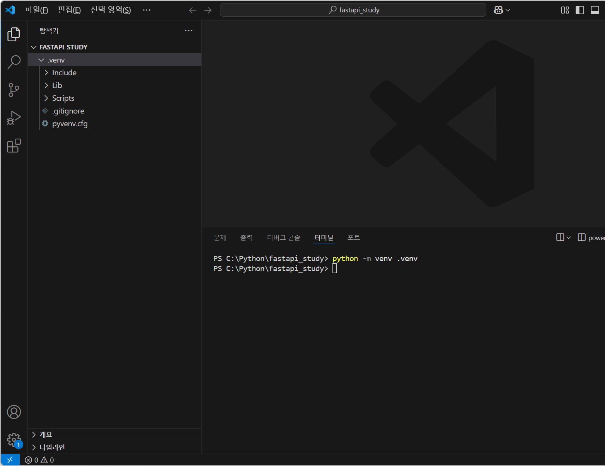
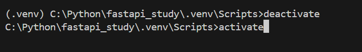
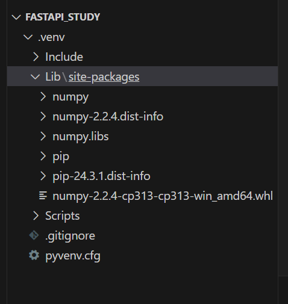
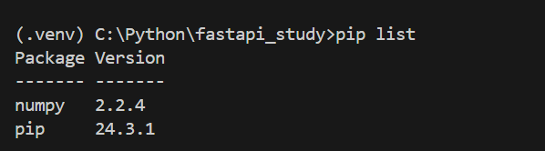
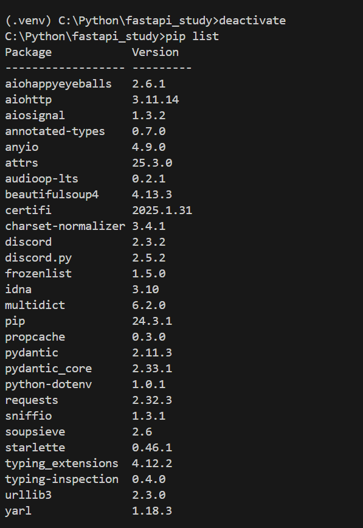

# 가상환경

파이썬의 가상환경은 프로젝트 마다 독립적인 **패키지/라이브러리 환경**을 만들 수 있게 해주는 기능이다.

여러 프로젝트를 진행하다 보니 여러 라이브러리를 install 하게 된다. 예를 들어 A 프로젝트는 1.0 버전인 라이브러리를 사용한다면 B 프로젝트는 2.0 버전을 사용중이다. 버전 충돌이 발생하는 상황이 생신다.

이런 상황을 방지하기 위해 만든게 가상환경이다.

## **가상환경 만들기**

가상환경을 둔 프로젝트를 하나 생성

```python
python -m venv .venv
```

위 명령어로 가상환경을 만들어 준다. 가상환경의 이름은 .venv 이다.



설치후엔 이렇게 폴더가 생성된다. lib엔 설치한 모듈이 저장된다. 뭔가 node.js에서 node module 폴더 같은 느낌! 

그럼 가상환경을 active 해서 모듈을 실행해보겠다.

```python
call .venv/Scripts/avtivate
```



Scripts 폴더 안에 있는 **activate** 를 실행시켜주면 된다.

실행 후 커맨드 라인 앞에 가상환경 폴더 이름이 뜨면 성공

가상환경을 나갈땐 **deactivate 를** 실행 하면된다.

그럼 가상환경 활성 단계에서 모듈을 설치 해보겠다.

```python
pip install numpy
```

간단한 numpy 모듈을 설치!!



설치 완료 후 Lib 폴더로 가면 numpy 모듈을 확인 가능하다

그리고 pip list에서 설치한 모듈을 확인



그럼 진짜 가상환경에만 설치 되었는지 확인을 위해선 deactivate를 한 후 pip list 명령어로 확인



deactivate 후 pip list는 내가 설치한 목록들만 보이고 있다.

## 트러블슈팅: activate 실행 정책 오류

[PowerShell 실행 정책 관련 참고](https://infinitt.tistory.com/43)

PowerShell에서 `activate`를 실행하면 아래처럼 실행 정책 때문에 막히는 경우가 있다.

```python
.\activate : 이 시스템에서 스크립트를 실행할 수 없으므로 C:\Python\study2\.venv\Scripts\Activate.ps1 파일을 로드할 수 없습니다. 자세한 내용은 about_Execution_Policies(https://go.microsoft.com/fwlink/?Lin
kID=135170)를 참조하십시오.
위치 줄:1 문자:1
+ .\activate
+ ~~~~~~~~~~
    + CategoryInfo          : 보안 오류: (:) [], PSSecurityException
    + FullyQualifiedErrorId : UnauthorizedAccess
```
