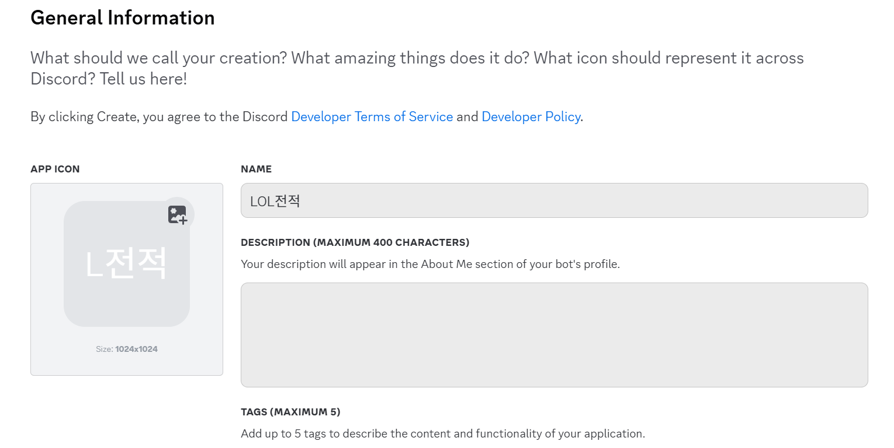
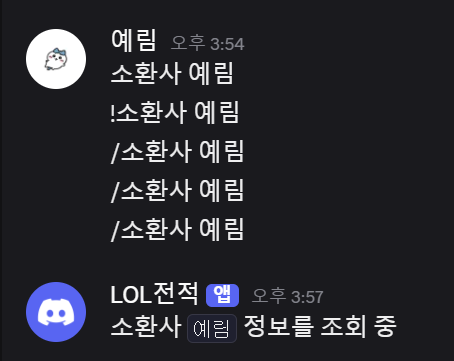

# 롤 전적 검색 봇 만들기 1

간단하게 전적 검색을 할 수 있는 디스코드 봇 만들기

```python
lol_discord_bot/
│
├── bot.py            # 디스코드 봇 시작점
├── riot_api.py       # Riot API 호출 모듈
├── .env              # API 키 저장
└── requirements.txt
```

파일 구조!

1. Riot api-key 발급, discord 봇 생성
    
    
    
    신규 봇 만들고 token 도 발급 받아 주었다. OAuth2 메뉴에서 Bot 설정도 빼먹지 않기
    
    [롤 개발자 apikey 발급](롤-개발자-apikey-발급.md) Riot Token도 발급 완료
    
2. pip install

```python
pip install discord.py python-dotenv
```

필요한 모듈 install하기

1. 소스작성

```python
import discord
from discord.ext import commands
from dotenv import load_dotenv
import os

load_dotenv()
DISCORD_TOKEN = os.getenv("DISCORD_BOT_TOKEN")
# RIOT_TOKEN = os.getenv("RIOT_API_KEY")

intents = discord.Intents.default()
intents.message_content = True

bot = commands.Bot(command_prefix='/', intents=intents)

@bot.event
async def on_ready():
    print(f"전적 봇 실행 : {bot.user}")

@bot.command(name="소환사")
async def summoner(ctx, *, summoner_name):
    print(summoner_name)
    await ctx.send(f"소환사 `{summoner_name}` 정보를 조회 중")

bot.run(DISCORD_TOKEN)
```

기본적인 입력 소스부터 작성,

`intents.message_content = True` 를 적어줘야 명령어를 알아듣는다.. 빼먹지 말기



명령어가 안먹혀서 당황했지만 기본적인 단계는 완료
