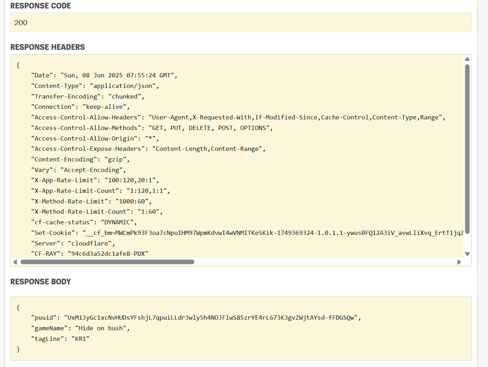
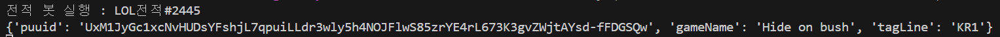

# 롤 전적 검색 봇 만들기 2

riot_api.py를 생성하여 라이엇 api를 호출해보는 소스 작성하기

1. 사용할 api 조회하기
    
    ```python
    https://developer.riotgames.com/apis#summoner-v4/GET_getBySummonerName - /lol/summoner/v4/summoners/by-name/{summonerName}
    ```
    
    유저 이름으로 정보를 가져오는 api를 찾았으나
    
    *2023년 11월 20일부터 소환사 이름 대신 Riot ID를 사용하여 리그 오브 레전드 및 TFT 플레이어를 공식적으로 참조하는 시스템으로 전환합니다. 따라서 관련 API를 업데이트해야 합니다. 이 전환에 대한 자세한 내용은 아래에서 확인하실 수 있습니다.*
    
    사용하지 못한단다..
    
    [Riot Developer Portal](https://developer.riotgames.com/apis#account-v1/GET_getByRiotId)
    
    위의 api로 사용이 필요하다 tagname까지 적어줘야한다.. tagName 조회는 어떻게 하는지에 대해서는 안나와 잇는데.. 일단 KR1로 통일하기로 하였다.
    
    위 api 문서에서 직접 응답값도 확인 가능하다.
    
    
    
    Hide on bush 계정의 puuid 발급 완료, puuid의 기준으로 .api 조회를 할 수 있으니 사용자의 puuid 확인 필수
    
2. riot_api.py 작성

```python
import requests
import os
from dotenv import load_dotenv

load_dotenv(dotenv_path="./.env")
RIOT_API_KEY = os.getenv("RIOT_API_KEY")

HEADERS = {"X-Riot-Token": RIOT_API_KEY}
API_URL = f"https://asia.api.riotgames.com"

def get_summoner_info(summoner_name):
    tag_line = "KR1"
    url = f"{API_URL}/riot/account/v1/accounts/by-riot-id/{summoner_name}/{tag_line}"
    return requests.get(url, headers=HEADERS).json()
```

api 동작확인을 위하여 간단히 작성!!

해당 파일은 이전에 작성해둔 bot.py에서 임포트 하기

```python
from riot_api import get_summoner_info

.
.
.
.

@bot.command(name="소환사")
async def summoner(ctx, *, summoner_name):
    await ctx.send(f"소환사 `{summoner_name}` 정보를 조회 중")
    result = get_summoner_info(summoner_name) 
```

이전에 만들어 둔 소스에 작성하고..

디스코드 명령어로 확인해보기



확인 완료!!

그러나 태그라인값에대해선 생각해보기.. ㅜㅜ
