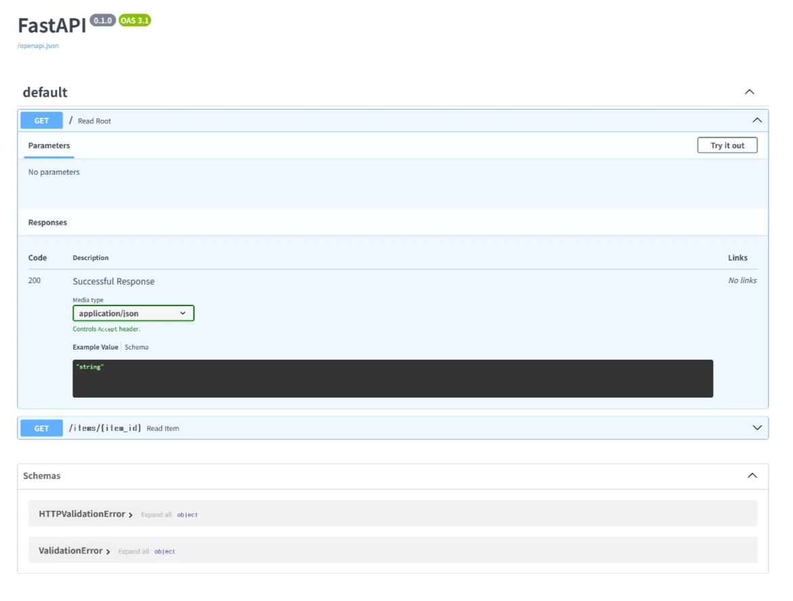
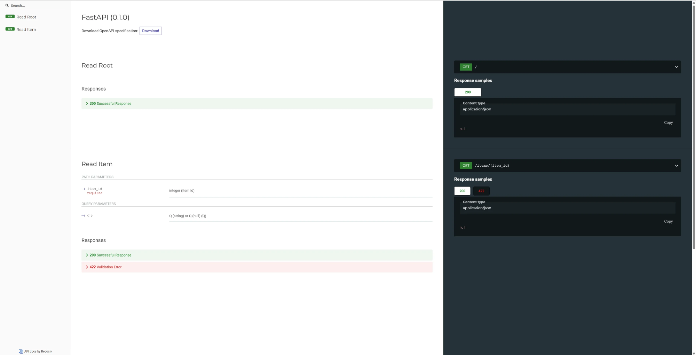

# FastApi 설치 및 실행

1. 설치
    
    ```python
    pip install fastapi
    pip install uvicorn
    ```
    

1. [main.py](http://main.py) 생성
    
    ```python
    from typing import Union
    
    from fastapi import FastAPI
    
    app = FastAPI()
    
    @app.get("/")
    def read_root():
        return {"Hello": "World"}
    
    @app.get("/items/{item_id}")
    def read_item(item_id: int, q: Union[str, None] = None):
        return {"item_id": item_id, "q": q}
    ```
    
    내용은 공식문서에서 가져왔다.
    
2. 실행
    
    ```python
    uvicorn main:app --reload
    ```
    

1. 접속
    
    [http://127.0.0.1:8000/docs#/](http://127.0.0.1:8000/docs#/)
    



redoc으로 접속하면



진짜 간단하다
