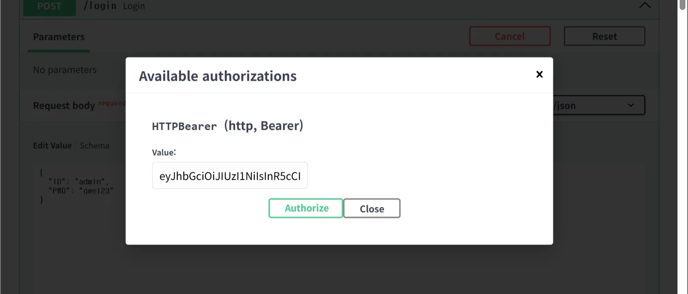
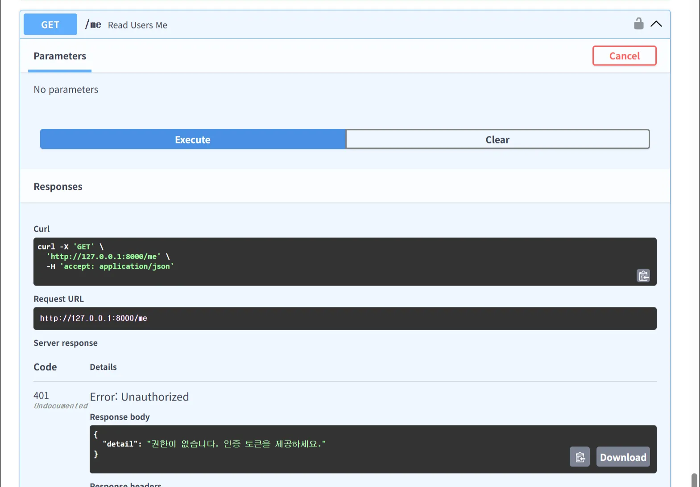
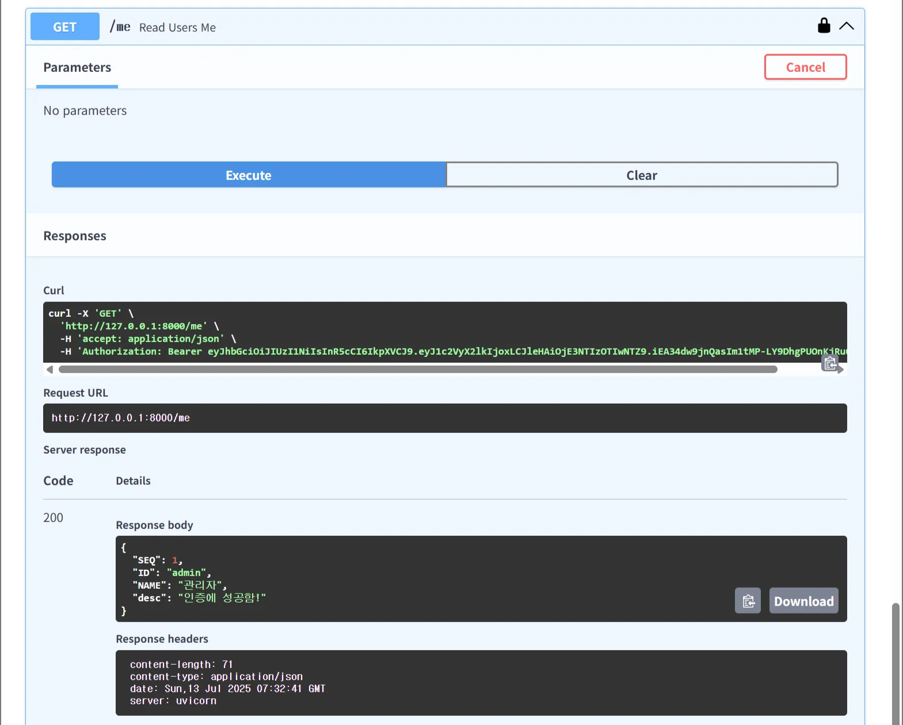

# JWT 인증 토큰 검사

```python
from fastapi.security import HTTPBearer, HTTPAuthorizationCredentials
security = HTTPBearer(auto_error=False)

def auth_check(credentials: HTTPAuthorizationCredentials = Depends(security)):
    if credentials is None:
        raise HTTPException(status_code=401, detail="권한이 없습니다. 인증 토큰을 제공하세요.")

    token = credentials.credentials
    try:
        payload = jwt.decode(token, SECRET_KEY, algorithms=[ALGORITHM])
        user_id = payload.get("user_id")
        db = SessionLocal()
        user = db.query(User).filter(User.SEQ == user_id).first()
        db.close()

        if user is None:
            raise HTTPException(status_code=401, detail="유효하지 않은 토큰입니다.")
        return user

    except jwt.ExpiredSignatureError:
        raise HTTPException(status_code=401, detail="토큰이 만료되었습니다.")
    except Exception:
        raise HTTPException(status_code=401, detail="유효하지 않은 토큰입니다.")
```

- Authorization 헤더에서 Bearer 토큰 가져오기
- 토큰 없으면 401 에러
- 토큰 복호화 → payload 추출
- payload에서 user_id 가져오기
- DB에서 user_id에 해당하는 사용자 찾기
- 없으면 401 에러
- 있으면 user 반환
- 토큰 만료/잘못된 경우도 401 에러

```python
@app.get("/me")
def read_users_me(current_user: User = Depends(auth_check)):
    return {
        "SEQ": current_user.SEQ,
        "ID": current_user.ID,
        "NAME": current_user.NAME,
        "desc" : "인증에 성공함!"
    }
```

토큰 인증을 확인하는 간단한 api 작성



일단 먼저 로그인을 하여 토큰을 발급하고 Authorize 진행



먼저 토큰을 지정하지 않고 호출을 하면 401 에러를 발생한다.



발급받은 token을 이용하여 호출 시 데이터를 불러와짐!

OAuth2 인증으로 바꾸는것도 해봐야겠땅
